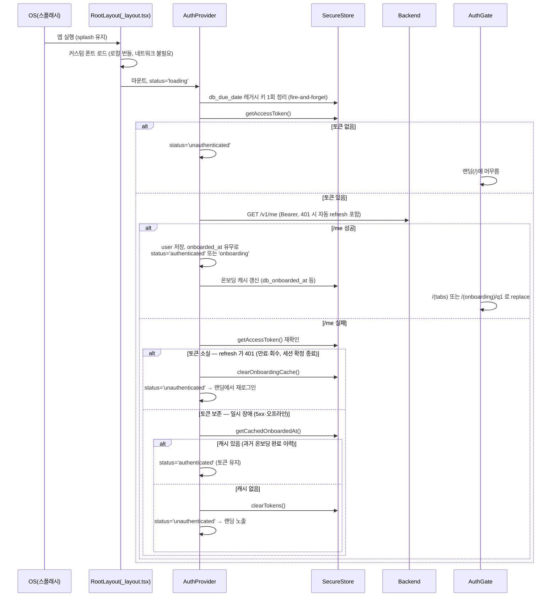
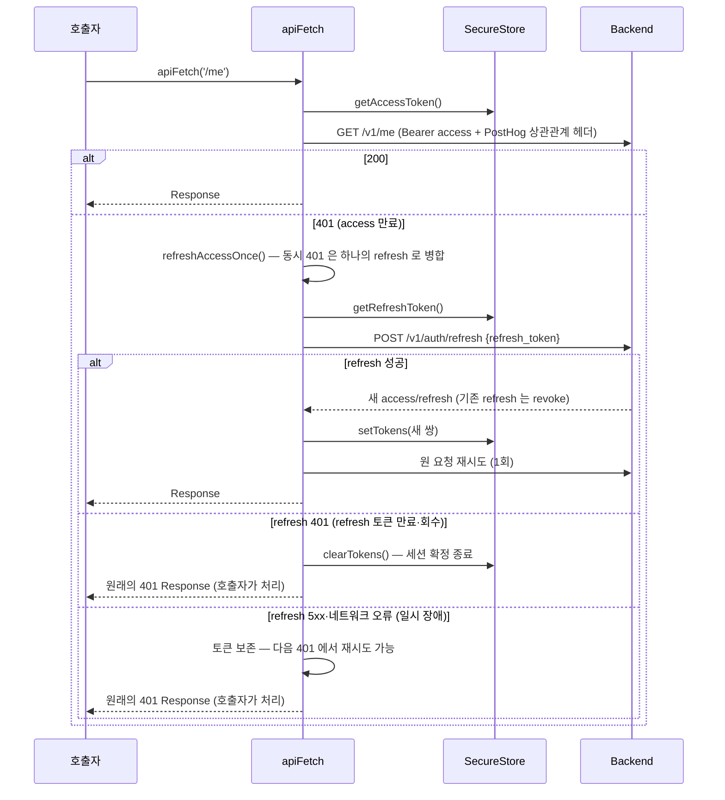

# 클라이언트 로그인 과정 리포트

본 문서는 dear-baby(아이에게) 앱의 로그인 과정을 **클라이언트(Expo/React Native, `app/`) 관점**에서 상세히 기술한다. 백엔드 내부 구현은 클라이언트가 의존하는 계약(엔드포인트·응답 형식·토큰 수명)에 한해서만 다룬다.

- 작성일: 2026-07-03 · 최종 갱신: 2026-07-04
- 기준 커밋: `0fad00b` + 동일 브랜치의 refresh 만료 부트 처리 수정 반영 (§5 "장기 미접속 복귀")

---

## 1. 한눈에 보기

로그인 수단은 세 가지이며, 셋 모두 최종적으로 동일한 경로(`AuthContext.setSession`)로 수렴한다.

| 수단 | 노출 조건 | 네이티브 SDK | 백엔드 교환 엔드포인트 |
|---|---|---|---|
| Apple 로그인 | iOS 이면서 `AppleAuthentication.isAvailableAsync()` 가 true | `expo-apple-authentication` | `POST /v1/auth/apple` |
| Google 로그인 | `EXPO_PUBLIC_GOOGLE_WEB_CLIENT_ID` 가 설정된 iOS/Android | `@react-native-google-signin/google-signin` | `POST /v1/auth/google` |
| 테스터(패스워드) 로그인 | 랜딩 화면의 시크릿 탭 제스처로만 진입 (프로덕션 포함) | 없음 (일반 폼) | `POST /v1/auth/password-login` |

공통 원리: **네이티브 SDK 가 발급한 자격 증명(id_token / authorization code / 패스워드)을 백엔드에 교환 요청 → 백엔드가 검증 후 자체 JWT access/refresh 쌍 + `user` 를 응답 → 클라이언트가 SecureStore 에 저장하고 인증 상태를 전이**한다. 이후 모든 API 는 자체 JWT 만 사용하며, 소셜 자격 증명은 재사용되지 않는다.

### 관련 파일 지도

| 역할 | 파일 |
|---|---|
| 랜딩(로그인) 화면 | `app/app/(landing)/index.tsx` |
| 인증 상태 머신·세션 수립 | `app/src/auth/AuthContext.tsx` |
| 토큰 저장소 (SecureStore) | `app/src/auth/tokens.ts` |
| 온보딩 완료 캐시 (오프라인 폴백) | `app/src/auth/onboardingCache.ts` |
| 인증 API 호출 (교환·/me·로그아웃) | `app/src/api/auth.ts` |
| 공통 fetch 래퍼 (Bearer 주입·401 자동 갱신) | `app/src/api/client.ts` |
| 라우팅 가드 (AuthGate) | `app/app/_layout.tsx` |
| 시크릿 탭 제스처 | `app/src/auth/useTesterLoginGesture.ts` |
| 테스터 로그인 모달 | `app/src/auth/TesterLoginModal.tsx` |
| 환경 변수 | `app/src/config/env.ts`, `app/.env.example` |
| 분석 계정 동기화 (PostHog) | `app/src/analytics/useAnalyticsIdentity.ts` |
| E2E 검증 | `e2e/maestro/login.yaml`, `e2e/maestro/subflows/tester-login.yaml` |

---

## 2. 앱 부팅 → 랜딩 화면까지 (콜드 스타트)

로그인 UI 가 보이기 전, 부팅 시퀀스가 "이미 로그인된 사용자인지"를 먼저 판정한다.



핵심 규칙:

- **`status === 'loading'` 동안 AuthGate 는 아무 리다이렉트도 하지 않는다.** 콜드 부팅 시 랜딩 화면이 먼저 보이는 것은 Maestro 헬스 플로우가 의존하는 동작이다 (`app/app/_layout.tsx:36`).
- 부팅 중 상태가 자동으로 `authenticated`/`onboarding` 으로 바뀌는 곳은 **AuthProvider 의 부트 이펙트 한 곳뿐**이다 (`app/src/auth/AuthContext.tsx:102`).
- `/me` 실패 시의 캐시 폴백은 "비행기 모드·백엔드 순단에서 온보딩 완료 사용자를 온보딩 깔때기로 되돌리지 않기 위한" 장치다. 백엔드가 진실의 원천이고 캐시는 힌트일 뿐이다 (`app/src/auth/onboardingCache.ts` 상단 주석).
- 폴백 전에 **토큰이 아직 남아 있는지 먼저 확인**한다. `/me` 처리 중 refresh 토큰이 401(만료·회수)로 판정되면 `apiFetch` 가 토큰 쌍을 이미 지웠으므로, 이는 일시 장애가 아니라 **세션의 확정 종료**다 — 캐시와 무관하게 랜딩으로 보내 재로그인시킨다 (§5 "장기 미접속 복귀").

### 랜딩 화면 구성 (`app/app/(landing)/index.tsx`)

- 히어로(Dear/Baby 로고 + 태그라인) → 로그인 버튼 영역 → "계속하시면 이용약관과 개인정보 처리방침에 동의합니다" 푸터 순서.
- 버튼 노출 조건:
  - Apple 버튼: `Platform.OS === 'ios'` **그리고** `isAvailableAsync()` 성공 시에만 렌더. 자체 스타일의 커스텀 버튼(HIG 허용 범위)이며 실제 플로우는 `expo-apple-authentication` 을 사용.
  - Google 버튼: `EXPO_PUBLIC_GOOGLE_WEB_CLIENT_ID` 가 있을 때만 `GoogleSignin.configure()` 실행·버튼 렌더. CI 처럼 클라이언트 ID 가 없는 빌드에서도 랜딩은 깨지지 않는다. 웹 플랫폼은 네이티브 모듈 부재로 제외 — **웹 빌드에는 로그인 UI 가 없다.**
- 마운트 시 `${EXPO_PUBLIC_API_URL}/health` 를 1회 호출해 실패하면 "서버에 연결할 수 없어요" 토스트를 3.5초 노출한다. 이 헬스체크는 로그인 자체를 막지 않으며, CI 의 백엔드 기동 검증(`health-check-complete` sentinel)에 쓰인다.
- 화면 좌상단·우상단에 **보이지 않는 80×80 Pressable** 두 개가 있다(테스터 로그인 제스처용, §3.3). 접근성 트리에서 숨기면 Maestro 가 조작할 수 없으므로 의도적으로 노출 상태를 유지한다.

---

## 3. 로그인 수단별 상세 흐름

### 3.1 Apple 로그인 (iOS 전용)

파일: `app/app/(landing)/index.tsx` (`AppleSignInButton`), `app/src/api/auth.ts` (`exchangeAppleAuthCode`)

1. `AppleAuthentication.signInAsync({ requestedScopes: [FULL_NAME, EMAIL] })` 로 네이티브 시트를 띄운다.
2. 반환된 `credential.authorizationCode` 가 없으면 `console.error` 후 중단.
3. `POST /v1/auth/apple` 에 다음 body 를 전송:
   ```json
   { "code": "<authorizationCode>", "given_name": "<givenName|''>", "family_name": "<familyName|''>" }
   ```
   이름은 **Apple 이 최초 로그인 1회에만 내려주므로** 클라이언트가 코드와 함께 백엔드로 전달한다. 백엔드가 Apple 토큰 엔드포인트와 코드를 교환하고 id_token 을 검증한 뒤 세션을 발급한다.
4. 응답(`SessionResponse`)을 `Session` 으로 매핑해 `setSession()` 호출 (§4).
5. 사용자가 시트를 닫으면 `ERR_REQUEST_CANCELED` — 조용히 무시.

네이티브 설정 의존성: `app.json` 의 `ios.usesAppleSignIn: true` + `expo-apple-authentication` 플러그인 (Sign in with Apple entitlement).

### 3.2 Google 로그인 (iOS·Android)

파일: `app/app/(landing)/index.tsx` (`GoogleSignInButton`), `app/src/api/auth.ts` (`exchangeGoogleIdToken`)

1. 모듈 로드 시점에 `GoogleSignin.configure({ webClientId, iosClientId? })` 가 1회 실행된다.
   - **웹 클라이언트 ID 가 ID 토큰의 audience** 가 된다 — 백엔드가 단일 audience 로 검증하기 위함.
   - Android 용 OAuth 클라이언트는 런타임에 전달하지 않는다. 패키지명+서명 인증서로 Google Play Services 가 자동 선택하므로, Cloud Console 에 등록돼 있기만 하면 된다.
   - iOS 는 추가로 reversed client ID URL scheme(`GOOGLE_IOS_URL_SCHEME`)이 `app.config.ts` 에서 플러그인 설정으로 주입돼야 OAuth 콜백이 돌아온다.
2. Android 에서는 먼저 `GoogleSignin.hasPlayServices()` 로 Play Services 가용성을 확인.
3. `GoogleSignin.signIn()` → 성공 응답에서 `idToken` 추출. 없으면 `console.error` 후 중단.
4. `POST /v1/auth/google` 에 `{ "id_token": "<idToken>" }` 전송. 백엔드는 Google JWKS 로 서명을 검증한 뒤 세션을 발급한다.
5. `setSession()` 호출 (§4).
6. `SIGN_IN_CANCELLED` 는 조용히 무시, 그 외 오류는 `console.error`.

### 3.3 테스터(패스워드) 로그인 — 시크릿 제스처

파일: `app/src/auth/useTesterLoginGesture.ts`, `app/src/auth/TesterLoginModal.tsx`

App Store 심사자와 Maestro E2E 가 사용하는 경로로, **빌드 플래그 없이 프로덕션에도 포함**된다. 게이트는 두 겹이다: (1) 제스처를 알아야 모달이 열리고, (2) 시드된 테스트 계정 자격 증명(백엔드 `TEST_USER_EMAIL`/`TEST_USER_PASSWORD`)을 알아야 로그인된다.

제스처 규칙 (`TESTER_LOGIN_GESTURE`):

- 좌상단 코너를 **5~7회(포함)** 탭 → 이어서 우상단 코너를 **10회 이상** 탭. 10번째 우상단 탭에서 모달이 열린다.
- 탭 간격이 **5초**를 넘으면 진행 상태가 리셋된다.
- 좌측 8회 이상(상한 초과), 우측 단계 진입 후 좌측 탭, 좌측 5회 미만 상태에서 우측 탭 — 모두 리셋. 일반 사용자가 우연히 진입하지 못하도록 엄격하게 검증한다.

모달 제출 시:

1. `POST /v1/auth/password-login` 에 `{ "email", "password" }` 전송 (email 은 trim).
2. 성공 시 OAuth 버튼과 **완전히 동일하게** `setSession()` 으로 세션을 수립하고 모달을 닫는다.
3. 실패 시 인라인 에러 "로그인에 실패했어요. 이메일과 비밀번호를 확인해주세요." 를 표시한다 (세 수단 중 유일하게 사용자 가시적 에러 UI 가 있는 경로).

---

## 4. 세션 수립 — `setSession` 이후 일어나는 일

세 수단 모두 `Session { accessToken, refreshToken, user }` 를 얻어 `AuthContext.setSession()` 을 호출한다 (`app/src/auth/AuthContext.tsx:138`).

1. **토큰 영속화**: `SecureStore`(iOS Keychain / Android Keystore 기반)에 저장.
   - `db_access_token`, `db_refresh_token` (`app/src/auth/tokens.ts`)
2. **user 상태 반영**: React 상태에 `user` 저장.
3. **상태 전이**: `user.onboarded_at` 이 있으면 `authenticated`, 없으면(신규 가입 포함) `onboarding`.
4. **온보딩 캐시 갱신**: `db_onboarded_at`, `db_first_record_at` 을 user 값으로 미러링 (부팅 폴백용, §2).

상태 머신 전체:

```
loading ──(토큰 없음)──────────────→ unauthenticated
loading ──(/me 성공·onboarded)─────→ authenticated
loading ──(/me 성공·미온보딩)───────→ onboarding
loading ──(/me 실패·refresh 만료로 토큰 소실)→ unauthenticated (재로그인)
loading ──(/me 실패·토큰 보존·캐시 있음)─────→ authenticated
loading ──(/me 실패·토큰 보존·캐시 없음)─────→ unauthenticated
unauthenticated ──(setSession)────→ onboarding | authenticated
onboarding ──(온보딩 완료 API 성공)─→ authenticated
임의 상태 ──(signOut)──────────────→ unauthenticated
```

### 로그인 직후 라우팅 (AuthGate)

`app/app/_layout.tsx` 의 AuthGate 가 `status` 와 현재 세그먼트를 보고 강제 리다이렉트한다:

| status | 현재 위치 | 동작 |
|---|---|---|
| `authenticated` | `(tabs)`/인증 모달·다이어리 외 | `router.replace('/(tabs)')` — 홈 진입 |
| `onboarding` | `(onboarding)` 외 | `router.replace('/(onboarding)/q1')` — 온보딩 깔때기 진입 |
| `unauthenticated` | `(tabs)`·`(onboarding)`·인증 모달 안 | `router.replace('/')` — 랜딩으로 축출 |
| `loading` | 어디든 | 아무것도 안 함 |

즉 **신규 사용자는 로그인 → 온보딩(q1) → (완료 시) 홈**, 기존 사용자는 **로그인 → 홈** 으로 자동 분기되며, 화면 코드가 개별적으로 내비게이션할 필요가 없다.

### 분석(PostHog) 동기화

`useAnalyticsIdentity` 가 auth 상태를 구독해, 로그인/온보딩 완료 시 `posthog.identify(user.id, { onboarded, has_first_record })`, 로그아웃 시 `posthog.reset()` 을 호출한다. 공용 기기에서 이벤트가 다른 계정으로 귀속되는 것을 막는다.

---

## 5. 세션 유지 — 자동 로그인과 토큰 갱신

### 백엔드 토큰 계약 (클라이언트가 의존하는 것)

- access/refresh 는 백엔드 자체 서명 JWT. 기본 TTL 은 **access 15분, refresh 30일** (`JWT_ACCESS_TTL`/`JWT_REFRESH_TTL` 로 조정 가능, `backend/internal/config/config.go:104`).
- refresh 는 **회전(rotation)** 된다: `POST /v1/auth/refresh` 성공 시 이전 refresh 토큰은 서버에서 revoke 되고 새 access/refresh 쌍이 내려온다. 클라이언트는 두 토큰을 모두 덮어써야 하며, 실제로 그렇게 한다 (`app/src/api/client.ts:32`).

### `apiFetch` 의 401 자동 갱신 (`app/src/api/client.ts`)

인증이 필요한 모든 호출(`/me`, 온보딩 제출, 기록 CRUD 등)은 `apiFetch` 를 거친다:



세부 동작:

- **동시성 병합**: 화면 진입 직후 여러 요청이 한꺼번에 401 을 맞아도 `refreshingPromise` 모듈 변수로 refresh 호출은 1회만 나간다.
- **재시도는 1회**: 갱신 후에도 401 이면 그대로 반환 — 호출자가 실패를 처리한다.
- **실패 구분**: refresh 응답이 **401 일 때만** 토큰 쌍을 삭제한다(refresh 토큰 자체의 만료·회수 = 세션 확정 종료). 5xx·게이트웨이 오류·네트워크 예외는 토큰을 보존해, 백엔드가 회복되면 다음 401 에서 세션이 자동 복구된다.
- `apiFetch` 는 Authorization 주입·401 갱신 외에는 관여하지 않는다. 나머지 상태 코드 처리는 호출자 책임.
- PostHog 세션/distinct ID 를 `X-PostHog-Session-Id`/`X-PostHog-Distinct-Id` 헤더로 동봉해 백엔드 로그와 세션 리플레이를 연결한다.
- 참고: 로그인 교환 API 3종(`google`/`apple`/`password-login`)과 `refresh`/`logout` 은 Bearer 가 불필요하므로 `apiFetch` 를 쓰지 않고 raw `fetch` 를 사용한다.

### 앱 재실행 시 자동 로그인

§2 의 부트 시퀀스가 곧 자동 로그인이다. 저장된 access 토큰이 있으면 `/me` 를 호출하고(만료 시 위 401→refresh 경로로 자동 회복), 성공하면 랜딩을 거의 거치지 않고 홈/온보딩으로 진입한다. refresh 토큰까지 만료(기본 30일 미접속)한 경우에만 랜딩으로 떨어져 재로그인이 필요하다.

### 장기 미접속 복귀 — refresh 토큰까지 만료된 경우

기본 설정(refresh 30일) 기준, 마지막 세션 갱신 후 30일 이상 앱을 열지 않은 사용자가 겪는 경로다.

1. SecureStore 에는 만료된 access/refresh 토큰이 문자열로 그대로 남아 있으므로(JWT 만료는 저장소를 지우지 않는다), 부트는 `/me` 를 시도한다.
2. 만료된 access → 401 → `apiFetch` 가 refresh 를 시도 → 백엔드가 401 응답 (`invalid refresh token`).
3. `refreshAccessOnce` 가 **토큰 쌍을 삭제**하고, `/me` 는 최종 실패(throw)한다.
4. AuthContext 의 catch 가 `getAccessToken()` 을 재확인한다 — 토큰이 사라졌으므로 세션 확정 종료로 판정하고, `clearOnboardingCache()` 로 로컬 상태를 `signOut` 과 동일하게 정리한 뒤 `unauthenticated` 로 전이한다.
5. AuthGate 가 랜딩 화면을 유지 → 사용자는 소셜 버튼으로 재로그인한다. 재로그인 시 `setSession` 이 토큰·캐시를 새로 채우므로 이후 부팅은 정상 경로로 돌아온다.

> **이력**: 수정 전에는 4단계에서 온보딩 캐시만 보고 `authenticated` 로 폴백했다. 토큰이 없으니 모든 API 가 401 이고(access 부재 시 refresh 재시도 자체가 없음) 랜딩으로 돌아갈 자동 경로도 없어, 앱을 재시작할 때까지 "데이터 로드가 전부 실패하는 홈 화면"에 갇혔다. 현재는 **토큰 소실 여부**로 확정 종료(재로그인)와 일시 장애(캐시 폴백)를 구분한다. 회귀 테스트: `app/src/auth/__tests__/AuthContext.test.tsx`, `app/src/api/__tests__/client.test.ts`.

---

## 6. 로그아웃 (`AuthContext.signOut`)

설정 탭 등에서 `signOut()` 호출 시:

1. 저장된 refresh 토큰이 있으면 `POST /v1/auth/logout` 으로 서버 revoke 를 시도한다. **실패해도 무시** — 로컬 토큰 삭제가 로그아웃의 진실의 원천이다 (`app/src/api/auth.ts:94`).
2. `clearTokens()` — SecureStore 의 access/refresh 삭제.
3. `clearOnboardingCache()` — `db_onboarded_at`/`db_first_record_at` 삭제 (다음 사용자의 부팅 폴백 오염 방지).
4. `user=null`, `status='unauthenticated'` → AuthGate 가 랜딩으로 축출, PostHog `reset()`.

---

## 7. 에러 처리 매트릭스 (사용자 관점)

| 상황 | 클라이언트 동작 | 사용자가 보는 것 |
|---|---|---|
| Apple/Google 시트에서 취소 | 코드로 식별해 조용히 무시 | 아무 일 없음 (정상) |
| Google Play Services 없음 (Android) | `hasPlayServices()` 예외 → catch → `console.error` | **무반응** |
| 소셜 SDK 성공했지만 idToken/authCode 누락 | `console.error` 후 중단 | **무반응** |
| 교환 API non-ok (4xx/5xx) / 네트워크 오류 | `Error` throw → catch → `console.error` | **무반응** |
| 테스터 로그인 실패 | 인라인 에러 문구 표시 | "로그인에 실패했어요…" |
| 부팅 `/me` 일시 장애(토큰 보존) + 온보딩 캐시 있음 | `authenticated` 유지 | 홈 진입 (프로필은 폴백 표기) |
| 부팅 `/me` 일시 장애(토큰 보존) + 캐시 없음 | 토큰 삭제 → `unauthenticated` | 랜딩 화면 |
| 부팅 시 refresh 만료 (장기 미접속) | 토큰·온보딩 캐시 삭제 → `unauthenticated` | 랜딩 화면 (재로그인) |
| API 401 → refresh 성공 | 투명하게 재시도 | 아무 일 없음 |
| API 401 → refresh 401 (만료·회수) | 토큰 삭제, 401 반환 | 다음 부팅/가드 시점에 랜딩 |
| API 401 → refresh 5xx·네트워크 오류 | 토큰 보존, 401 반환 | 일시 오류 — 백엔드 회복 후 자동 복구 |
| 헬스체크 실패 | 토스트 3.5초 | "서버에 연결할 수 없어요" |

---

## 8. 환경 변수·네이티브 설정 의존성

| 항목 | 용도 | 미설정 시 |
|---|---|---|
| `EXPO_PUBLIC_API_URL` | 모든 API 베이스 URL | `http://localhost:8080` 폴백 |
| `EXPO_PUBLIC_GOOGLE_WEB_CLIENT_ID` | Google ID 토큰 audience | Google 버튼 미노출 (랜딩은 정상) |
| `EXPO_PUBLIC_GOOGLE_IOS_CLIENT_ID` | iOS Google 클라이언트 | 선택값 |
| `GOOGLE_IOS_URL_SCHEME` (prebuild) | iOS OAuth 콜백 URL scheme | prebuild 실패 (필수) |
| `app.json` `ios.usesAppleSignIn` + `expo-apple-authentication` 플러그인 | Apple 로그인 entitlement | Apple 버튼 동작 불가 |
| `expo-secure-store` 플러그인 | 토큰 저장 | — |

`EXPO_PUBLIC_*` 값은 **빌드 타임에 JS 번들로 인라인**되므로 런타임 교체가 불가능하다는 점에 유의 (`app/src/config/env.ts`).

---

## 9. E2E 검증 (Maestro)

- `e2e/maestro/login.yaml`: `clearKeychain` + `clearState` 로 콜드 상태에서 시작해, 시크릿 제스처 → 테스터 로그인 → 모달 닫힘까지 검증한다. 자격 증명은 CI 가 `MAESTRO_TEST_USER_EMAIL`/`MAESTRO_TEST_USER_PASSWORD` 로 주입하며 백엔드의 `TEST_USER_*` 시크릿과 일치해야 한다.
- `e2e/maestro/subflows/tester-login.yaml`: 다른 플로우(온보딩·홈 등)가 재사용하는 로그인 서브플로우. 좌상단 5탭 → 우상단 10탭 → 이메일/비밀번호 입력을 testID(`tester-corner-tl`, `tester-login-email` 등)로 구동한다. 키보드 Next/Done 체인으로 `hideKeyboard`(iOS 에서 모달을 닫아버리는 제스처)를 회피하는 등, 화면 구현이 E2E 구동 가능성을 전제로 설계돼 있다.
- OAuth 경로(Apple/Google)는 외부 계정 의존 때문에 E2E 자동화 대상이 아니며, 테스터 로그인이 "세션 수립 이후" 공통 경로를 대신 커버한다.

---

## 10. 관찰 사항 (리스크·개선 여지)

코드를 검토하며 발견한, 동작에 영향을 줄 수 있는 특이점들이다. 모두 현재 코드 기준 사실 확인된 내용이며, 수정 여부는 별도 판단이 필요하다.

1. **소셜 로그인 실패 시 사용자 피드백이 없다.** 취소를 제외한 모든 실패(네트워크 오류, 백엔드 4xx/5xx, idToken 누락)가 `console.error` 로만 남는다. 사용자는 버튼을 눌러도 아무 일이 없는 것처럼 보인다. 테스터 로그인만 인라인 에러 UI 가 있다.
2. **일시 장애 폴백 시 `user` 가 `null` 인 채로 `authenticated` 가 된다.** (refresh 확정 만료 케이스는 §5 "장기 미접속 복귀" 수정으로 랜딩으로 보내지만, 토큰이 보존된 일시 장애 + 캐시 케이스는 여전히 이 경로다.) 홈은 `user?.name` 폴백('우리 아이')으로 렌더는 되지만 복구를 위한 `/me` 재시도는 없다 — 이후 다른 API 호출이 성공해 user 를 갱신해 줄 때까지 프로필 정보가 비어 있다.
3. ~~refresh 응답이 non-ok 이기만 하면 토큰을 삭제한다~~ **(해결됨, 2026-07-04)** — 이제 401 일 때만 토큰을 삭제하고, 5xx·네트워크 오류는 토큰을 보존해 다음 401 에서 재시도한다. 같은 수정에서 "refresh 만료 후 캐시 폴백으로 좀비 홈 화면에 갇히는" 장기 미접속 버그도 함께 해소됐다 (§5 "장기 미접속 복귀" 이력 참고).
4. **랜딩 푸터의 "이용약관"·"개인정보 처리방침"이 링크 스타일이지만 실제 onPress 핸들러가 없다.** 심사 시 지적될 수 있는 지점이다.
5. **테스터 로그인 경로가 프로덕션 빌드·프로덕션 서버에 상시 존재한다.** 이는 의도된 설계(심사·E2E 공용, 게이트는 제스처+시드 자격 증명)이지만, 자격 증명 관리가 곧 보안 경계라는 점은 인지하고 있어야 한다.
6. **로그아웃의 서버 revoke 는 best-effort** 다. 오프라인 로그아웃 시 서버 측 refresh 토큰이 TTL(기본 30일)까지 유효하게 남는다. 단, 토큰이 기기 SecureStore 에만 있으므로 실질 위험은 기기 탈취 시나리오에 한정된다.
