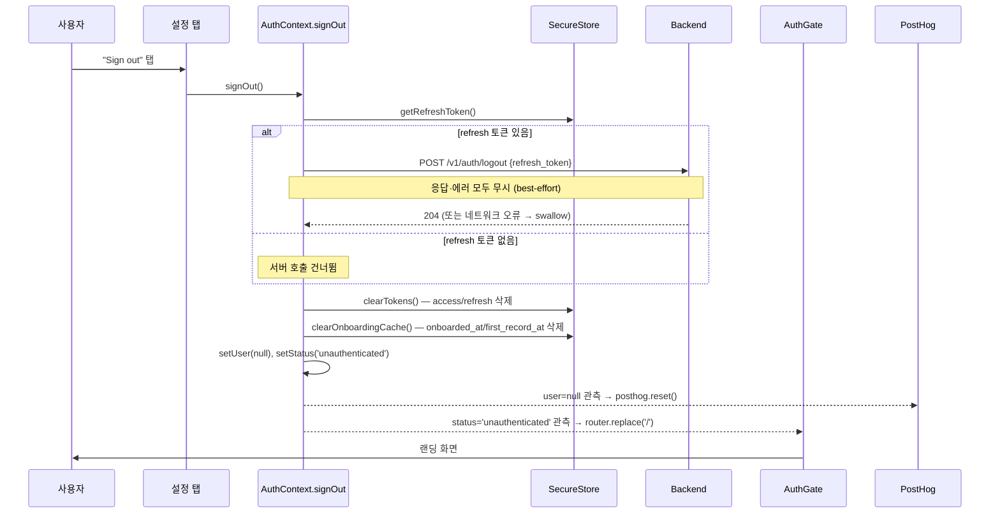

# 클라이언트 로그아웃 과정 리포트

본 문서는 dear-baby(아이에게) 앱의 로그아웃 과정을 **클라이언트(Expo/React Native, `app/`) 관점**에서 상세히 기술한다. 백엔드 내부 구현은 클라이언트가 의존하는 계약(엔드포인트·응답 형식·revoke 의미)에 한해서만 다룬다. 로그인 과정은 별도 문서(`client-login-process.md`)를 참고하고, 본 문서는 그 §6 "로그아웃"을 확장한다.

- 작성일: 2026-07-04
- 기준 커밋: `87a7814`

---

## 1. 한눈에 보기

로그아웃은 트리거 주체에 따라 두 갈래이며, 둘 다 최종적으로 **동일한 로컬 정리 프리미티브**(SecureStore 토큰·캐시 삭제)로 수렴한다.

| 유형 | 트리거 | 사용자 의도 | 서버 revoke 시도 |
|---|---|---|---|
| **명시적 로그아웃** | 설정 탭 "Sign out" 버튼 → `signOut()` | 있음 (사용자 개시) | 함 (best-effort) |
| **강제 로그아웃 (세션 사망)** | refresh 토큰 만료·회수가 API 흐름에서 감지됨 | 없음 (세션 확정 종료) | 안 함 (이미 무효) |

공통 원리: **로컬 토큰 삭제가 로그아웃의 진실의 원천**이다. 서버에 refresh 토큰 revoke 를 요청하지만, 그 성공 여부와 무관하게 클라이언트는 SecureStore 의 토큰을 지우고 `unauthenticated` 로 전이한다. 서버 revoke 는 실패해도 무시되는 best-effort 부수 작업이다 (`app/src/api/auth.ts:92`).

### 관련 파일 지도

| 역할 | 파일 |
|---|---|
| 로그아웃 UI (Sign out 버튼) | `app/app/(tabs)/settings.tsx` |
| 인증 상태 머신·`signOut` 구현 | `app/src/auth/AuthContext.tsx` |
| 토큰 저장소 (SecureStore) — `clearTokens` | `app/src/auth/tokens.ts` |
| 온보딩 완료 캐시 — `clearOnboardingCache` | `app/src/auth/onboardingCache.ts` |
| 로그아웃 API 호출 (`logout`) | `app/src/api/auth.ts` |
| 강제 로그아웃 (401→refresh 401 시 토큰 삭제) | `app/src/api/client.ts` |
| 라우팅 가드 (AuthGate) — 랜딩 축출 | `app/app/_layout.tsx` |
| 분석 리셋 (PostHog `reset`) | `app/src/analytics/useAnalyticsIdentity.ts` |
| 활성 아이 컨텍스트 리셋 | `app/src/context/ActiveChildContext.tsx` |
| 백엔드 revoke 계약 | `backend/internal/auth/handlers.go`, `service.go`, `store.go` |
| 회귀 테스트 | `app/src/auth/__tests__/AuthContext.test.tsx`, `app/src/api/__tests__/client.test.ts` |

---

## 2. 명시적 로그아웃 — `signOut()` 상세 흐름

설정 탭의 "Sign out" 버튼이 유일한 사용자 개시 진입점이다 (`app/app/(tabs)/settings.tsx:22`). 버튼은 `onPress={signOut}` 로 컨텍스트의 `signOut` 을 **직접** 호출한다 — 확인 다이얼로그·로딩 인디케이터가 없다(§8 관찰).



`signOut` 구현 (`app/src/auth/AuthContext.tsx:225`):

```ts
const signOut = useCallback(async () => {
  const refresh = await getRefreshToken();
  if (refresh) {
    await apiLogout(refresh);   // best-effort 서버 revoke
  }
  await clearTokens();          // SecureStore access/refresh 삭제
  await clearOnboardingCache(); // db_onboarded_at / db_first_record_at 삭제
  setUser(null);
  setStatus('unauthenticated');
}, []);
```

단계별 의미:

1. **refresh 토큰 조회** — 서버 revoke 대상. 이미 지워졌으면(강제 로그아웃 후 등) 서버 호출을 건너뛰고 곧장 로컬 정리로 간다.
2. **서버 revoke 요청** — `apiLogout` 은 raw `fetch` 로 `POST /v1/auth/logout` 을 호출한다. **Bearer 를 붙이지 않으며** `apiFetch` 를 거치지 않는다(§3). 내부에서 예외를 삼키므로 오프라인·서버 장애에서도 절대 throw 하지 않는다 (`app/src/api/auth.ts:94`).
3. **로컬 토큰 삭제** — `clearTokens()` 가 SecureStore 의 `db_access_token`·`db_refresh_token` 을 삭제한다 (`app/src/auth/tokens.ts:19`). 이 시점부터 기기에 자격 증명이 없다.
4. **온보딩 캐시 삭제** — `clearOnboardingCache()` 가 `db_onboarded_at`·`db_first_record_at` 을 삭제한다 (`app/src/auth/onboardingCache.ts:58`). 다음 사용자가 같은 기기에서 부팅 폴백(로그인 리포트 §2)으로 **이전 사용자의 온보딩 상태를 물려받지 않도록** 하기 위함이다.
5. **상태 전이** — React 상태 `user=null`, `status='unauthenticated'`. 이 두 setState 가 이후의 모든 부수효과(§5)를 촉발한다.

**순서가 중요한 이유**: refresh 토큰은 삭제 **이전에** 읽어 서버로 보낸다. clearTokens 를 먼저 하면 revoke 대상이 사라진다. 반대로 서버 revoke 는 로컬 삭제 **이전에 await** 되므로, 느리거나 멈춘 네트워크에서는 로컬 로그아웃이 그만큼 지연된다(§8 관찰).

---

## 3. 백엔드 revoke 계약 (클라이언트가 의존하는 것)

클라이언트는 로그아웃 시 다음 계약에만 의존한다. 내부 구현(토큰 해시·DB 컬럼)은 알 필요가 없다.

- **엔드포인트**: `POST /v1/auth/logout`, body `{ "refresh_token": "<token>" }`.
- **Bearer 불필요**: 이 라우트는 `RequireAuth` 미들웨어 **밖에** 마운트돼 있다 (`backend/internal/app/router.go:119` — line 128 의 인증 그룹보다 위). 즉 access 토큰 없이도 호출 가능하며, 인증은 오직 **body 의 refresh 토큰 소유**로 이뤄진다. 그래서 클라이언트가 `apiFetch`(Bearer 주입·401 갱신)를 우회해 raw `fetch` 를 쓴다 — 로그아웃 시점엔 access 가 곧 무효화될 것이고, 401 자동 갱신 로직이 개입할 이유가 없다.
- **응답**: **항상 `204 No Content`**. body 파싱 실패·refresh 토큰 누락·유효하지 않은 토큰 — 어떤 경우든 204 다 (`backend/internal/auth/handlers.go:166`). refresh 토큰의 유효 여부를 노출하지 않기 위한 안티-enumeration 설계다.
- **revoke 동작**: 서버는 토큰 해시로 `refresh_tokens.revoked_at` 을 스탬프한다 (`store.go` `Revoke`). 이미 revoke 됐거나 없는 토큰이면 no-op. `Service.Logout` 은 revoke 오류마저 무시하고 nil 을 반환한다 (`service.go`).

클라이언트 관점 요약: **응답 코드를 읽지도 않는다.** `apiLogout` 은 `fetch` 결과를 무시하고, 오직 예외만 try/catch 로 삼킨다. 서버가 무엇을 응답하든 로컬 정리는 그대로 진행된다.

---

## 4. 강제 로그아웃 — 세션 사망 경로

사용자가 버튼을 누르지 않아도, refresh 토큰이 만료·회수되면 세션은 확정 종료된다. 이 "강제 로그아웃"은 두 지점에서 감지되며, `signOut` 과 **부분적으로만** 같은 정리를 한다.

### 4.1 세션 사용 중 — `apiFetch` 의 401→refresh(401)

인증이 필요한 호출이 401 을 맞으면 `apiFetch` 가 refresh 를 시도한다. refresh 응답이 **401**(토큰 자체 만료·회수)이면 `refreshAccessOnce` 가 토큰 쌍을 삭제한다 (`app/src/api/client.ts:30`).

```ts
if (res.status === 401) {
  await clearTokens();   // 세션 확정 종료 — 토큰 쌍 삭제
}
return null;
```

**중요한 한계**: 이 경로는 **SecureStore 토큰만 지우고 React 상태(`user`/`status`)는 건드리지 않는다.** `client.ts` 는 `AuthContext` 를 알지 못한다. 따라서 세션 사용 중 refresh 가 죽어도 화면은 즉시 랜딩으로 튕기지 않고 **`authenticated` 상태에 머문다.** 이후 API 호출은 access 토큰이 없어(`getAccessToken()===null`) Bearer 없이 나가고, `apiFetch` 의 `res.status === 401 && access` 가드가 access 부재로 refresh 재시도조차 하지 않으므로, 그냥 401 이 반환돼 각 화면이 데이터 로드 실패로 처리한다. **실질적 로그아웃(랜딩 축출)은 다음 앱 재시작의 부트 시퀀스에서 이뤄진다**(§4.2, §8 관찰 2).

- refresh 응답이 **5xx·네트워크 오류**(일시 장애)면 토큰을 **보존**한다 — 백엔드 회복 후 다음 401 에서 세션이 자동 복구된다. 순단만으로 강제 로그아웃되지 않게 하는 장치다 (`app/src/api/__tests__/client.test.ts:142`).

### 4.2 앱 부트 시 — `/me` 실패 + 토큰 소실

콜드 부트에서 저장된 access 로 `/me` 를 호출하는데(로그인 리포트 §2), 그 과정에서 §4.1 의 refresh 401 이 일어나면 토큰이 이미 지워진 채로 `/me` 가 최종 실패한다. `AuthContext` 의 catch 가 이를 감지한다 (`app/src/auth/AuthContext.tsx:118`):

```ts
const accessAfterMe = await getAccessToken();
if (!accessAfterMe) {
  // 토큰이 사라졌다 = 세션 확정 종료 (강제 로그아웃).
  await clearOnboardingCache();   // signOut 의 로컬 정리를 그대로 복제
  setStatus('unauthenticated');
  return;
}
```

여기서 **`signOut` 의 캐시 정리를 의도적으로 미러링**한다: 강제 종료도 로그아웃이므로 다음 부팅이 이 사용자의 온보딩 캐시를 참조하면 안 된다 (`AuthContext.tsx:135` 주석, 회귀 테스트 `AuthContext.test.tsx:139`). 이 정리가 없으면 캐시 폴백으로 "모든 API 가 401 인 좀비 홈 화면"에 갇힌다(로그인 리포트 §5 이력).

### 4.3 세 경로 비교

| | 명시적 `signOut` | 강제 (세션 중, §4.1) | 강제 (부트, §4.2) |
|---|---|---|---|
| 서버 revoke (`/auth/logout`) | **함** | 안 함 | 안 함 |
| `clearTokens()` | 함 (직접) | 함 (`apiFetch` 내부) | 이미 지워짐 |
| `clearOnboardingCache()` | 함 | **안 함** | 함 (복제) |
| React `user=null` | 함 | **안 함** (재시작까지 유지) | — (`setUser` 미호출, 초기값 `null` 유지) |
| `status='unauthenticated'` | 즉시 | **다음 부트에서** | 함 |
| PostHog `reset()` | 함 | 다음 부트에서 | 함 |
| 사용자 체감 | 즉시 랜딩 | 데이터 로드 실패 → 재시작 후 랜딩 | 랜딩 (재로그인) |

---

## 5. 로그아웃 후 — 상태 전이·라우팅·부수효과

`signOut`(또는 부트 강제 경로)이 `status='unauthenticated'` 로 전이시키면, 이를 구독하는 세 소비자가 연쇄적으로 반응한다.

### 상태 머신

```
임의 상태(authenticated | onboarding) ──(signOut)──────────→ unauthenticated
authenticated ──(세션 중 refresh 401)──→ authenticated* (토큰만 소실, 재시작까지 UI 유지)
loading ──(부트 /me 실패·토큰 소실)─────→ unauthenticated (강제 로그아웃)
```

### 부수효과 1 — AuthGate 라우팅 (`app/app/_layout.tsx:58`)

```ts
} else if (
  status === 'unauthenticated' &&
  (inTabs || inOnboarding || inAuthedModal)
) {
  router.replace('/');   // 랜딩으로 축출
}
```

`unauthenticated` 이면서 사용자가 `(tabs)`·`(onboarding)`·인증 모달(record-*·drafts·diary) 안에 있으면 랜딩(`/`)으로 `replace` 한다. 설정 탭은 `(tabs)` 안이므로 로그아웃 즉시 랜딩으로 밀려난다. `replace` 이므로 뒤로 가기로 되돌아올 수 없다.

### 부수효과 2 — PostHog 리셋 (`app/src/analytics/useAnalyticsIdentity.ts:30`)

`user` 가 `null` 로 바뀌면 `posthog.reset()` 을 호출해 distinct ID 를 익명으로 되돌린다. 공용 기기에서 다음 사용자의 이벤트가 이전 계정에 귀속되는 것을 막는다. (`lastIdentifiedRef` 가 있을 때만 reset — 중복 호출 방지.)

### 부수효과 3 — 활성 아이 컨텍스트 리셋 (`app/src/context/ActiveChildContext.tsx:123`)

`user` 가 `null` 이 되면 `hydratedUserId=null`, `activeIndex=0` 으로 리셋한다. **단, AsyncStorage 의 `active_child_index:<userId>` 키는 지우지 않는다** — 키가 userId 로 prefix 돼 있어 다음 로그인 시 자기 키만 hydrate 하면 stale 데이터가 보이지 않기 때문이다. 이는 의도된 설계다 (`ActiveChildContext.tsx:8` 주석).

---

## 6. 무엇이 지워지고 무엇이 남는가

명시적 `signOut` 기준, 기기에 남는 흔적을 정확히 정리한다. "로그아웃 = 로컬 토큰 삭제"의 실제 경계다.

| 항목 | 저장소 | 로그아웃 시 | 비고 |
|---|---|---|---|
| `db_access_token` | SecureStore | **삭제** | `clearTokens` |
| `db_refresh_token` | SecureStore | **삭제** | `clearTokens` |
| `db_onboarded_at` | SecureStore | **삭제** | `clearOnboardingCache` |
| `db_first_record_at` | SecureStore | **삭제** | `clearOnboardingCache` |
| React `user` / `status` | 메모리 | **리셋** | `null` / `unauthenticated` |
| PostHog distinct ID | PostHog SDK | **리셋** | `reset()` (익명화) |
| `db_draft_*` (온보딩 진행 입력) | SecureStore | **남음** ⚠️ | `signOut` 이 `clearOnboardingDraft` 호출 안 함 (§8 관찰 1) |
| `active_child_index:<userId>` | AsyncStorage | **남음** | 의도적 (userId prefix 로 격리) |
| `db_due_date` (레거시) | SecureStore | 남음 | 부팅 시에만 1회 정리 (`cleanupLegacyDueDateKey`) |
| 서버측 refresh 토큰 | 백엔드 DB | 온라인이면 revoke, **오프라인이면 TTL(기본 30일)까지 유효** | best-effort (§8 관찰 4) |
| 화면 상태(records·diary 목록 등) | 메모리 | 언마운트로 소멸 | 랜딩 replace 시 트리 제거 |

---

## 7. 에러 처리·엣지 케이스 매트릭스

| 상황 | 클라이언트 동작 | 사용자가 보는 것 |
|---|---|---|
| 정상 온라인 로그아웃 | 서버 204 → 로컬 정리 → 랜딩 | 즉시 랜딩 화면 |
| 오프라인 로그아웃 | `apiLogout` 예외 삼킴 → 로컬 정리 진행 | 랜딩 (서버 토큰은 TTL 까지 유효) |
| 서버 5xx 로그아웃 | 응답 무시 → 로컬 정리 진행 | 랜딩 (로컬 로그아웃 성공) |
| refresh 토큰이 이미 없음 | `apiLogout` 건너뜀 → 로컬 정리 | 랜딩 |
| 느린/멈춘 네트워크 | `await apiLogout` 이 settle 될 때까지 로컬 정리 지연 | 버튼 무반응처럼 보임 (§8 관찰 3) |
| `clearTokens`/`clearOnboardingCache` 예외 | try/catch 없음 → `signOut` reject, setState 미도달 | **로그아웃 실패, 피드백 없음** (§8 관찰 3) |
| 세션 중 refresh 401 (§4.1) | 토큰만 삭제, 상태 유지 | 데이터 로드 실패 → 재시작 후 랜딩 |
| 부트 시 refresh 만료 (§4.2) | 토큰·캐시 삭제 → unauthenticated | 랜딩 (재로그인) |

---

## 8. 관찰 사항 (리스크·개선 여지)

코드를 검토하며 발견한, 동작에 영향을 줄 수 있는 특이점들이다. 모두 현재 코드(`87a7814`) 기준 사실 확인된 내용이며, 수정 여부는 별도 판단이 필요하다.

1. **온보딩 draft 가 로그아웃 시 삭제되지 않는다 — 교차 계정 노출 여지.** `signOut` 은 `clearOnboardingCache`(=`db_onboarded_at`/`db_first_record_at`)만 지우고 `clearOnboardingDraft`(=`db_draft_*`)는 호출하지 않는다 (`AuthContext.tsx:225`). draft 는 오직 온보딩 **완료** 시에만 삭제된다 (`OnboardingContext.tsx:304`). 따라서 사용자 A 가 온보딩 도중 로그아웃하면 `db_draft_q1_pregnant`·`db_draft_children`·`db_draft_purposes` 등이 SecureStore 에 남고, 같은 기기에서 신규 계정 B 로 로그인해 온보딩 깔때기에 진입하면 `OnboardingContext` 가 마운트 시 `loadOnboardingDraft()` 로 **A 의 진행 중 입력을 hydrate** 한다 (`OnboardingContext.tsx:151`). 공용·양도 기기에서 이전 사용자의 임신 여부·아이 정보·기록 목적이 다음 사용자에게 노출될 수 있다. → `signOut` 에 `clearOnboardingDraft()` 를 추가하는 것이 자연스러운 수정.

2. **세션 사용 중 refresh 만료가 즉시 UI 를 로그아웃시키지 않는다.** `apiFetch` 의 refresh 401 경로는 SecureStore 토큰만 지우고 React 상태를 건드리지 않는다(§4.1). 그 결과 사용자는 토큰이 없는데도 `authenticated` 화면에 머물며, 모든 API 가 조용히 401 로 실패한다(랜딩 복귀 자동 경로 없음 — 상태가 안 바뀌니 AuthGate 도 안 움직인다). 실질 로그아웃은 다음 앱 재시작에서야 일어난다(§4.2). 부트 경로는 로그인 리포트 §5 수정으로 좀비 홈 화면을 해소했지만, **세션 사용 중** 버전의 동일 증상은 남아 있다.

3. **`signOut` 에 에러 처리·확인·진행 피드백이 전혀 없다.** ① 설정 버튼이 `onPress={signOut}` 로 직결돼 확인 다이얼로그가 없다 — 오탭 한 번으로 로그아웃된다 (`settings.tsx:22`). ② `signOut` 내부에 try/catch 가 없어 `clearTokens`/`clearOnboardingCache` 가 throw 하면 setState 에 도달하지 못하고, `onPress` 는 결과를 await 하지 않으므로 unhandled rejection 으로 조용히 실패한다. ③ 서버 revoke 를 로컬 정리 **이전에** await 하므로, 오프라인·느린 네트워크에서 로컬 로그아웃이 `fetch` 가 settle 될 때까지 지연되는데 로딩 인디케이터가 없어 버튼이 먹통처럼 보인다.

4. **서버 revoke 는 best-effort 다.** 오프라인 로그아웃 시 서버 측 refresh 토큰이 TTL(기본 30일)까지 유효하게 남는다 (`onboardingCache`·`tokens` 는 기기에만 있으므로). 토큰이 기기 SecureStore 에만 존재하는 한 실질 위험은 기기 탈취 시나리오에 한정되지만, "로그아웃했으니 서버 세션도 끝났다"는 가정은 온라인일 때만 성립한다. (로그인 리포트 §10-6 과 동일 관찰.)

5. **"Sign out" 라벨이 영문이다.** 설정 화면 제목("설정")과 이메일은 한국어 UX 인데 버튼만 영문 `title="Sign out"` 이다 (`settings.tsx:24`). 나머지 앱 문구가 한국어인 점을 고려하면 i18n 불일치이며, 심사·QA 에서 지적될 수 있다.
