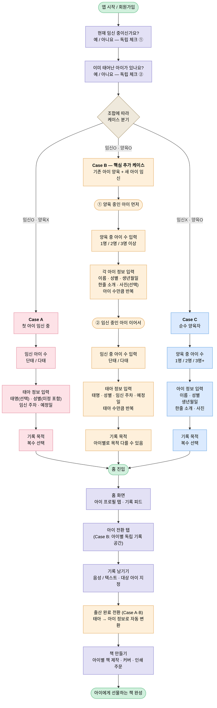

# Onboarding Flow — 케이스 분기 온보딩 전체 흐름도

## 개요

회원가입 직후 두 개의 독립 체크(임신 여부 / 양육 중인 아이 여부)를 통해 사용자를 세 가지 케이스로 분기하고, 각 케이스에 맞는 정보 입력을 거친 뒤 공통 메인 플로우로 합류시키는 전체 온보딩 흐름을 정의한다.

> 본 문서는 입력 단계와 분기 구조를 정의하는 **시스템 흐름도**이다. 각 화면의 카피·UI·점진적 공개 원칙은 [디자인 시스템 — 점진적 공개 온보딩](../design-system/onboarding.md)을 참고한다.

## 핵심 원칙

| 원칙 | 설명 |
|------|------|
| **🔀 독립 체크 분기** | 임신 여부와 양육 여부를 독립적으로 묻고, 그 조합으로 케이스를 결정한다 |
| **♻️ 케이스별 입력 분리** | 각 케이스(A/B/C)는 필요한 정보만 받고 불필요한 단계를 건너뛴다 |
| **🌊 공통 플로우 합류** | 입력이 끝나면 모든 케이스가 동일한 홈 화면 → 기록 → 책 만들기 흐름으로 합류한다 |

---

## 케이스 정의

| 케이스 | 조건 | 설명 |
|--------|------|------|
| **Case A** | 임신 O · 양육 X | 첫 아이를 임신 중인 사용자 |
| **Case B** | 임신 O · 양육 O | 기존 아이를 양육하면서 새 아이를 임신 중인 사용자 (핵심 추가 케이스) |
| **Case C** | 임신 X · 양육 O | 이미 태어난 아이만 양육 중인 사용자 |

---

## 전체 흐름도

---

## 단계별 상세

### 0. 진입 직전 — 두 개의 독립 체크

`현재 임신 중이신가요?`와 `이미 태어난 아이가 있나요?`를 각각 독립적으로 묻는다. 두 답변의 조합이 케이스를 결정한다.

| 임신 | 양육 | 케이스 |
|:---:|:---:|:---:|
| O | X | Case A |
| O | O | Case B |
| X | O | Case C |
| X | X | (현재 정의되지 않음 — 향후 검토) |

### 1. Case A — 첫 아이 임신 중

태아 정보 한 그룹만 입력받는 단순한 경로.

- 임신 아이 수 (단태 / 다태)
- 태아 정보 (태명·성별·임신 주차·예정일)
- 기록 목적 선택

### 2. Case B — 기존 아이 양육 + 새 아이 임신 (핵심 추가 케이스)

가장 복잡한 케이스로, **두 단계로 나뉘어 입력**한다.

**① 양육 중인 아이 먼저**
- 양육 중 아이 수 (1명/2명/3명 이상)
- 각 아이 정보 (아이 수만큼 반복)

**② 임신 중인 아이 이어서**
- 임신 중 아이 수 (단태/다태)
- 태아 정보 (태아 수만큼 반복)

**③ 기록 목적**
- 아이별로 목적이 다를 수 있음 → 아이별 선택 UI 필요

> Case B는 홈 화면에서 **아이 전환 탭**을 통해 아이별 독립 기록 공간을 제공한다.

### 3. Case C — 순수 양육자

태아 정보 없이 양육 중인 아이만 입력받는 경로.

- 양육 중 아이 수
- 각 아이 정보 (이름·성별·생년월일·한줄 소개·사진)
- 기록 목적 선택

### 4. 공통 플로우 (모든 케이스 공통)

홈 진입 후 모든 사용자가 거치는 동일한 흐름.

- **홈 화면**: 아이 프로필 탭 + 기록 피드
- **아이 전환 탭**: 아이별 독립 기록 공간 (Case B에서 특히 중요)
- **기록 남기기**: 음성 / 텍스트 + 대상 아이 지정
- **출산 완료 전환** (Case A·B): 태아 정보가 출생 후 자동으로 아이 정보로 변환됨
- **책 만들기**: 아이별로 책 제작 → 커버 선택 → 인쇄 주문
- **완성**: 아이에게 선물하는 실물 책

---

## 관련 문서

- [디자인 시스템 — 점진적 공개 온보딩](../design-system/onboarding.md) — 화면별 카피/UI 원칙 (Stage 1~3)
- [PRD-001: 음성 일기 기록](../prd/PRD-001-voice-diary.md)
- [PRD-004: 실물 책 제작](../prd/PRD-004-book-production.md)
- [용어집](../glossary.md)
