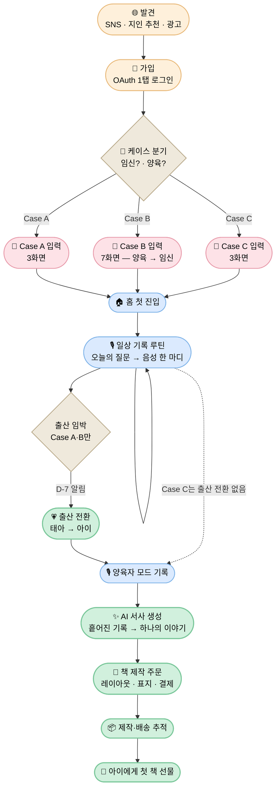

# 사용자 여정 (User Journeys)

> 임산부가 디어베이비를 처음 만나서 아이에게 첫 번째 책을 선물하기까지의 사용자 관점 여정 모음.

## 본 디렉토리의 위치

| 디렉토리 | 관점 | 답하는 질문 |
|---|---|---|
| [`flows/`](../flows) | **시스템** 관점 | "분기와 입력 단계가 어떻게 흐르는가?" |
| [`wireframes/`](../wireframes) | **화면** 관점 | "각 단계에서 어떤 화면이 보이는가?" |
| **`journeys/` (본 디렉토리)** | **사용자** 관점 | "사용자는 무엇을 느끼고 어떤 페인포인트를 만나는가?" |

세 디렉토리는 같은 흐름을 다른 시점에서 본다. 본 디렉토리의 문서들은 각 플로우가 **사용자에게 어떻게 체험되는가**를 평가하는 용도로 쓰인다.

## 문서 분할 원칙

| 원칙 | 설명 |
|------|------|
| **🧩 플로우 단위 분할** | 각 문서는 하나의 자족적 사용자 플로우(온보딩 / 일상 기록 / 출산 전환 / AI 서사 / 책 제작)를 다룬다 |
| **🔗 PRD 1:1 매핑** | 각 플로우 문서는 가능한 PRD-001~006 중 1~2개와 1:1 매핑된다 |
| **🌊 인계 명시** | 각 문서는 앞 플로우로부터 무엇을 인계받고, 다음 플로우로 무엇을 인계하는지 명시한다 |
| **🧭 가치 추적** | 각 단계에서 어떤 제품 가치(V-001~V-007)가 작동하는지 명시한다 |

---

## 페르소나

본 제품의 핵심 페르소나는 [`flows/onboarding-flow.md`](../flows/onboarding-flow.md)의 케이스 정의와 1:1 매핑된다.

### 🌸 Persona A — 처음 엄마가 되는 사람 (Case A)

- **상태**: 첫 아이 임신 중 · 기존 양육 경험 없음
- **마음가짐**: 모든 것이 처음이라 설레면서도 두렵다. 이 시간이 너무 빠르게 지나갈 것 같아 무언가 남기고 싶다
- **시간/에너지**: 입덧, 피로, 잦은 몸의 변화로 일관된 기록 시간을 내기 어렵다
- **기대**: "이 감정을 잊지 않고 아이에게 전해주고 싶다"

### 🌼 Persona B — 둘째를 맞이하는 엄마 (Case B) ★ 핵심 페르소나

- **상태**: 첫째(또는 다수) 양육 중 · 새 아이 임신 중
- **마음가짐**: 첫째 임신 때만큼 시간이 없고, "둘째라서 못 챙겨준다"는 죄책감이 있다
- **시간/에너지**: 기존 양육에 임신이 겹쳐 가장 시간이 부족한 상태
- **기대**: "첫째에게 못 했던 기록을 둘째에겐 남겨주고 싶다 / 두 아이 모두에게 공평하게 남겨주고 싶다"
- **차별 니즈**: 아이별 독립 컨텍스트 — 기록이 섞이면 안 된다

### 🌿 Persona C — 이미 아이를 키우고 있는 부모 (Case C)

- **상태**: 임신 X · 양육 O
- **마음가짐**: 지나간 임신 기간을 글로 남기지 못한 게 아쉽다. 지금부터라도 아이의 매일을 남기고 싶다
- **시간/에너지**: 양육 일과 속에서 짧은 틈을 활용해야 한다
- **기대**: "지금이라도 아이의 어린 시절을 책으로 남기고 싶다"

---

## 전체 여정 흐름도



> **감정 봉우리(peak moment)는 4곳**: ① 출산 전환 ② AI 서사 생성 ③ 책 수령 ④ 아이에게 선물. 이 4지점이 디어베이비의 정체성을 결정한다.

---

## 플로우 문서 구성

전체 여정은 5개의 플로우로 분할된다. 각 문서는 자족적이며, 앞뒤 플로우로부터의 인계를 명시한다.

| # | 플로우 문서 | 다루는 단계 | 관련 PRD | 핵심 페르소나 |
|:---:|---|---|---|:---:|
| 1 | [Onboarding Journey](onboarding-journey.md) | 발견 · 가입 · 케이스 분기 · 케이스별 입력 | PRD-006 | 🌸🌼🌿 |
| 2 | [Daily Recording Journey](daily-recording-journey.md) | 홈 첫 진입 · 일상 기록 루틴 | PRD-001, PRD-002, PRD-005 | 🌸🌼🌿 |
| 3 | [Birth Conversion Journey](birth-conversion-journey.md) | 출산 전환 · 양육자 모드 시작 | PRD-006 | 🌸🌼 |
| 4 | [AI Narrative Journey](ai-narrative-journey.md) | AI 서사 생성·편집 | PRD-003 | 🌸🌼🌿 |
| 5 | [Book Production Journey](book-production-journey.md) | 책 주문 · 배송 · 선물 | PRD-004 | 🌸🌼🌿 |

> 화살표(←/→)로 표시되는 인계 관계: 1 → 2 → (Case A·B만) 3 → 2(양육자 모드) → 4 → 5

---

## 케이스별 여정 비교

| 단계 | Case A 🌸 | Case B 🌼 | Case C 🌿 |
|---|---|---|---|
| 케이스 분기 | 임신 O · 양육 X | 임신 O · 양육 O | 임신 X · 양육 O |
| 입력 화면 수 | 3 | 7 | 3 |
| 입력 부담 | 낮음 | **높음** (단계 분리로 완화) | 낮음 |
| 출산 전환 | ✅ 거침 | ✅ 거침 (감정 봉우리) | ❌ 해당 없음 |
| 다자녀 컨텍스트 | (다태아 시만) | ✅ 핵심 기능 | (다자녀 시만) |
| 책 제작 단위 | 1권 | 아이별 N권 | 아이별 N권 |
| 핵심 모먼트 | 출산 전환 → 서사 → 책 | 양 케이스 동시 진행 + 출산 전환 | 서사 → 책 |

---

## 감정 곡선 (전역)

세로축은 사용자의 감정·동기 강도, 가로축은 여정 단계. 각 케이스의 감정 봉우리 위치를 시각화한다.

```
강도 ↑
높음 │                                            ●(서사)         ●(선물) 
     │                              ●(출산전환)    │              ╱
     │           ●(케이스분기 안도)   │            │           ╱
     │      ╱                       │            │        ╱  
중간 │   ●  ╲      일상 루틴 (반복)   │            │     ●(책 미리보기)
     │  (가입) ╲___________________  │  ──────── │ ╱
     │              ↓ 권태·이탈 위험            
낮음 │                ⚠ 페인포인트 구간         
     └────┬────┬────┬────┬────┬────┬────┬────┬────┬────┬────┬───→ 시간
       발견  가입  분기  입력  홈   일상   출산  양육 서사  주문  배송  선물
                                       전환  기록
```

> **이 곡선이 의미하는 것**: 일상 기록 루틴은 평탄한 구간이라 권태·이탈 위험이 가장 크다. 그 구간을 **푸시 알림 + 오늘의 질문**(PRD-002)이 지탱한다. 출산 전환과 서사 생성 두 봉우리가 사용자를 다음 사이클로 끌어올리는 동력이다.

---

## 가치 매핑 (전역)

각 플로우에서 어떤 제품 가치([VDOC-001](../values/product-values.md))가 작동하는지 정리한다. 각 플로우 문서에는 단계별 세부 매핑이 포함된다.

| 플로우 | V-001 감정 보존 | V-002 부담 제거 | V-003 서사 부여 | V-004 음성-텍스트 | V-005 주차 맞춤 | V-006 실물 책 | V-007 멀티미디어 |
|---|:---:|:---:|:---:|:---:|:---:|:---:|:---:|
| 1. Onboarding | ● | ●●● | | | ● | | ● |
| 2. Daily Recording | ●●● | ●●● | | ●●● | ●● | | ●● |
| 3. Birth Conversion | ●● | ●● | | | ●● | | |
| 4. AI Narrative | ●● | | ●●● | ●● | | | ●● |
| 5. Book Production | ●● | | ●● | | | ●●● | ● |

> ●●● 핵심 가치 / ●● 보조 가치 / ● 부수 가치

**관찰**:
- **V-001 (감정 보존)**은 거의 모든 플로우에 흐른다 — 제품의 정체성 가치
- **V-002 (부담 제거)**는 1~3 플로우에 집중 — 진입과 루틴의 마찰 제거
- **V-003 (서사 부여)**, **V-006 (실물 책)**은 후반(4~5)에 결실
- **V-005 (주차 맞춤)**가 약해지는 출산 전환 시점에서 컨텍스트가 양육 일수로 자연스럽게 전환되어야 한다 (PRD-006의 책임)

---

## 페인포인트 & 기회 (전역 요약)

각 플로우 문서에 상세 항목이 있다. 다음은 전역 위험 지점만 모은 요약.

| # | 플로우 | 핵심 페인포인트 | 상세 |
|---|---|---|---|
| 1 | Onboarding | Case B 7화면 입력의 길이 | [→ Onboarding Journey](onboarding-journey.md) |
| 2 | Daily Recording | "오늘 할 말이 없다" 무력감, STT 정확도 | [→ Daily Recording Journey](daily-recording-journey.md) |
| 3 | Birth Conversion | 사산·유산 케이스에서 카피의 잔인성 | [→ Birth Conversion Journey](birth-conversion-journey.md) |
| 4 | AI Narrative | "내 글을 AI가 고친다"는 거부감 | [→ AI Narrative Journey](ai-narrative-journey.md) |
| 5 | Book Production | 가격 부담, 배송 지역 제약 | [→ Book Production Journey](book-production-journey.md) |

---

## 미해결 / 향후 검토

본 여정 문서들은 PRD-006의 미해결 항목과 다음 항목들을 사용자 여정 관점에서 추가로 제기한다.

- **발견(Discovery) 정량화**: 본 디렉토리는 인지·유입 채널의 사용자 감정만 정성적으로 다룬다. 채널별 유입 데이터 기반의 별도 funnel 분석 필요
- **재참여 루프**: 책을 한 번 받은 사용자가 다시 일상 기록(플로우 2)으로 복귀하는 동기 부재 — Case B / 다자녀 양육자에 대한 후속 책 제작 유도 메커니즘 검토
- **사산·유산 케이스의 여정**: PRD-006 [아직이에요] 반복 후 D+14 한계 도달 시의 사용자 여정 별도 정의 필요 — 카피·플로우·심리적 안전장치 ([→ Birth Conversion Journey](birth-conversion-journey.md) 참고)
- **가족 공유 여정**: 와이어프레임의 기록 목적 중 "가족 공유" 옵션이 있으나, 본 여정은 1인 사용자 관점만 다룬다. 다인(엄마·아빠·조부모) 사용 여정 별도 검토 필요

---

## 관련 문서

- [`flows/onboarding-flow.md`](../flows/onboarding-flow.md) — 온보딩 시스템 흐름도
- [`wireframes/onboarding.md`](../wireframes/onboarding.md) — 온보딩 화면 와이어프레임
- [`values/product-values.md`](../values/product-values.md) — VDOC-001 제품 가치 정의서
- [`prd/`](../prd) — PRD-001~006
- [`glossary.md`](../glossary.md) — 도메인 용어
