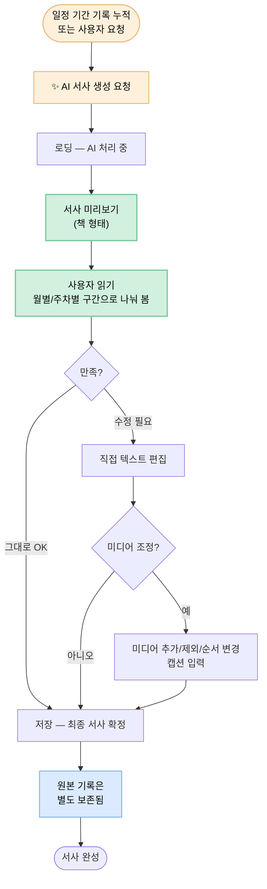

# AI Narrative Journey — AI 서사 생성 · 편집

> 사용자가 흘린 짧은 한 마디들이 한 편의 편지로 엮이는 순간. **본 플로우는 디어베이비의 두 번째 감정 봉우리이며, 제품 정체성을 가장 강하게 각인시키는 단계다.**

| 항목 | 내용 |
|---|---|
| **다루는 단계** | Stage 9 AI 서사 생성·편집 |
| **관련 PRD** | [PRD-003: AI 편집 & 서사 구성](../prd/PRD-003-ai-editing.md), [PRD-005: 미디어 통합](../prd/PRD-005-media-records.md) (AC-005-08) |
| **관련 페르소나** | 🌸 Case A · 🌼 Case B · 🌿 Case C 모두 |
| **앞 플로우로부터 인계** | 누적된 음성 일기·텍스트·미디어 ← [Daily Recording Journey](daily-recording-journey.md) |
| **다음 플로우로 인계** | 확정된 서사 (시간순으로 정리된 편지 형식 + 통합 미디어) → [Book Production Journey](book-production-journey.md) |

---

## 개요

흩어진 일상 기록을 AI가 시간순으로 정리하고 감성적인 서사로 재구성하여, **아기에게 전하는 편지** 형식의 이야기로 만든다. 사용자에게는 "내가 흘린 짧은 한 마디들이 한 편의 편지가 됐다"는 모먼트를 제공한다 — V-003 (서사적 의미 부여)의 핵심 체험.

**본 플로우의 위험**: AI가 만든 결과물이 사용자의 기대 이하라면 제품 전체의 약속(말로 전하는 사랑, AI가 완성하는 우리 아기 첫 번째 책)이 무너진다. 또한 "내 글을 AI가 고친다"는 거부감을 다루는 것이 본 플로우의 핵심 과제다.

---

## 흐름도



---

## 단계별 상세

### Stage 9-1 — ✨ AI 서사 생성 요청

| 축 | 내용 |
|---|---|
| **사용자 행동** | 일정 기간의 기록이 쌓이면 AI 서사 생성을 요청한다 (자동 추천 또는 사용자 직접 요청) |
| **사용자 감정·생각** | "AI가 내 기록을 어떻게 엮어줄까?" — 기대 + "내가 했던 말이 다시 가공된다고?" — 약간의 거부감 |
| **시스템 응답** | **PRD-003 / AC-003-01** — 일정 기간 기록 누적 시 AI 서사 생성 가능 / AI가 기록을 시간순으로 정리하고 서사적 흐름으로 재구성 |
| **페인포인트 / 기회** | ⚠️ "내 글이 가공된다"는 거부감 → 🌱 요청 직전 "원본은 그대로 보존됩니다"(AC-003-03) 안내 카피로 안전감 제공 |

### Stage 9-2 — 📖 서사 미리보기 ★ 두 번째 감정 봉우리

| 축 | 내용 |
|---|---|
| **사용자 행동** | 생성된 서사를 책 형태의 미리보기로 확인한다. 월별 또는 주차별로 구간을 나눠 읽는다 |
| **사용자 감정·생각** | **"내가 흘린 짧은 한 마디들이 한 편의 편지가 됐다"** — V-003의 핵심 체험. 이 순간이 디어베이비의 정체성을 가장 강하게 각인시킨다 / "내가 직접 안 썼는데도 진짜 내 마음이 담겼다" |
| **시스템 응답** | **PRD-003 / AC-003-02** — 책 형태의 미리보기, 월별/주차별 구간 분할 / **AC-003-04** — 첨부 미디어가 자동으로 서사에 포함됨 / **PRD-005 / AC-005-08** — 미디어와 텍스트 통합 표시 |
| **페인포인트 / 기회** | ⚠️ AI 서사 품질이 기대 이하라면 본 플로우의 모먼트가 무너지고 제품 전체의 약속이 깨진다 → 🌱 본 플로우의 모든 노력은 결국 "AI 출력 품질"에 수렴 |

### Stage 9-3 — ✏️ 사용자 편집

| 축 | 내용 |
|---|---|
| **사용자 행동** | AI 생성 텍스트를 직접 수정 / 미디어 추가·제외·순서 변경 / 미디어에 캡션 입력 |
| **사용자 감정·생각** | "AI가 거의 다 했지만, 내 손길도 들어가니까 진짜 내 책이 된다" / "이 사진은 빼는 게 낫겠다" |
| **시스템 응답** | **PRD-003 / AC-003-03** — 텍스트 수정, 저장 시 최종 서사 확정, **원본 기록은 별도 보존** / **AC-003-04** — 추가 사진 직접 첨부, 순서 변경, 제외, 캡션 입력 |
| **페인포인트 / 기회** | 🌱 "원본 기록 별도 보존" 정책이 사용자의 신뢰 안전장치 / ⚠️ 편집 UI가 부담스러우면 "그대로 OK"로 우회 가능해야 한다 |

### Stage 9-4 — ✅ 서사 확정

| 축 | 내용 |
|---|---|
| **사용자 행동** | 편집을 마치고 저장 → 최종 서사가 확정됨 |
| **사용자 감정·생각** | "이제 책으로 만들 준비가 됐다" — 다음 플로우로의 자연스러운 전환 |
| **시스템 응답** | 최종 서사가 저장되고, 책 제작(Book Production)으로 이어지는 진입점이 활성화됨 |
| **페인포인트 / 기회** | 🌱 확정 화면에서 책 제작으로의 이행이 자연스러우면 다음 플로우 전환률이 높아진다 |

---

## "AI가 내 글을 고친다"에 대한 거부감 분석

본 플로우의 가장 큰 사용자 저항 지점이다. 다음 메커니즘이 거부감을 흡수하는 데 동원된다.

| 거부감의 형태 | 완화 메커니즘 | 관련 AC |
|---|---|---|
| "내 진짜 마음이 다른 톤으로 바뀔까봐" | 편지 형식으로 일관된 톤 유지 | AC-003-01 |
| "AI가 잘못 해석하면 어쩌지" | 사용자 직접 편집 가능 | AC-003-03 |
| "원본이 사라질까봐" | 원본 기록 별도 보존 정책 | AC-003-03 |
| "기대했는데 결과가 별로일까봐" | 미리보기 후 만족 여부에 따라 편집 또는 그대로 진행 | AC-003-02·03 |

> **핵심**: 사용자에게 "AI는 보조자이고, 최종 결정권은 당신에게 있다"는 메시지가 명확히 전달되어야 한다.

---

## 사용자 감정 곡선

```
강도 ↑
높음 │                            ●(서사 미리보기 — 모먼트)
     │                          ╱  ╲
     │                        ╱      ╲
     │                      ╱          ╲(편집 부담 — 가벼운 dip)
중간 │ ●(요청 직전)        ╱              ╲
     │  ╲     ●(로딩 중   ╱                 ●(확정)
     │   ╲     기대감)   ╱
     │    ╲ ___________╱
낮음 │     "AI가 내 글을 고친다"는
     │     초기 거부감 흡수 구간
     └────┬────┬────┬────┬────┬────┬────→
       요청   로딩   미리   읽기   편집   확정
            처리   보기
```

> 본 플로우의 곡선은 짧지만 봉우리가 매우 가파르다. 미리보기 단계의 정점이 본 제품의 가장 큰 감정 모먼트 중 하나다.

---

## 페인포인트 & 기회

| # | 단계 | 페인포인트 | 완화 메커니즘 (현재) | 추가 기회 |
|---|---|---|---|---|
| 1 | Stage 9-1 | "내 글이 가공된다"는 거부감 | AC-003-03 원본 기록 별도 보존 | 요청 직전 안전감 카피 |
| 2 | Stage 9-1 | "언제 요청해야 하나" 판단 부담 | AC-003-01 일정 기간 기준 | 사용자에게 시점 추천 알림 |
| 3 | Stage 9-2 | **AI 출력 품질이 기대 이하** | (모델 품질에 의존) | **[Critical] 품질 평가 루프, 사용자 피드백 수집** |
| 4 | Stage 9-2 | 한 번 본 후의 만족도 회복 어려움 | (없음) | 낮은 만족도 시 재생성 옵션 |
| 5 | Stage 9-3 | 편집 UI가 복잡하면 부담 | AC-003-03 직접 수정 | "그대로 진행" 경로의 명확성 |
| 6 | Stage 9-3 | 미디어 순서 결정의 피로도 | AC-003-04 / AC-005-08 | AI가 추천 순서를 제시한 후 사용자가 조정 |

---

## 가치 매핑

| 단계 | V-001 감정 보존 | V-003 서사 부여 | V-004 음성-텍스트 | V-007 멀티미디어 |
|---|:---:|:---:|:---:|:---:|
| 9-1. 서사 생성 요청 | ● | ●● | ● | |
| 9-2. 서사 미리보기 (모먼트) | ●●● | ●●● | ●● | ●● |
| 9-3. 사용자 편집 | ●● | ●●● | | ●● |
| 9-4. 서사 확정 | ●● | ●●● | | ● |

> ●●● 핵심 가치 / ●● 보조 가치 / ● 부수 가치

**관찰**: 본 플로우는 V-003 (서사적 의미 부여)이 처음으로 만개하는 단계다. V-001 (감정 보존)은 줄곧 작동해왔지만, "흩어진 기록"이 "하나의 이야기"가 되면서 비로소 V-003가 결합된다. **V-001 + V-003 = 디어베이비의 정체성 선언.**

---

## 다음 플로우로의 인계

본 플로우 종료 시 다음 정보가 다음 플로우로 인계된다.

| 인계 항목 | 형식 |
|---|---|
| 확정 서사 | 시간순으로 정리된 편지 형식 텍스트 |
| 통합 미디어 | 텍스트와 함께 표시되도록 정렬된 사진/영상/음성 메모 (캡션 포함) |
| 원본 기록 | 별도 보존 (책 제작에 직접 사용되지 않음, 신뢰 안전장치 역할) |
| 책 제작 진입점 | 서사 확정 시 다음 플로우 진입 활성화 |

→ 사용자는 [Book Production Journey](book-production-journey.md)로 이행한다.

---

## 관련 문서

- [`prd/PRD-003-ai-editing.md`](../prd/PRD-003-ai-editing.md) — AI 편집 & 서사 구성
- [`prd/PRD-005-media-records.md`](../prd/PRD-005-media-records.md) — AC-005-08 미디어 AI 서사 연동
- [← 이전 플로우: Daily Recording Journey](daily-recording-journey.md)
- [→ 다음 플로우: Book Production Journey](book-production-journey.md)
- [← 인덱스로 돌아가기](README.md)
