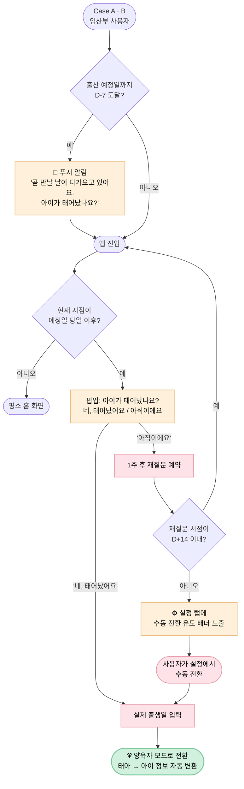

# Birth Conversion Journey — 출산 전환 (Case A · B)

> 임산부 페르소나가 양육자 페르소나로 전환되는 가장 큰 감정 모먼트. **본 플로우는 디어베이비의 첫 번째 감정 봉우리**이며, Case A·B 사용자만 거친다.

| 항목 | 내용 |
|---|---|
| **다루는 단계** | Stage 7 출산 전환 → Stage 8 양육자 모드 시작 |
| **관련 PRD** | [PRD-006: 케이스 분기 온보딩 및 아이 컨텍스트 관리](../prd/PRD-006-onboarding-cases.md) — AC-006-05 ~ AC-006-07 |
| **관련 페르소나** | 🌸 Case A · 🌼 Case B (Case C는 해당 없음) |
| **앞 플로우로부터 인계** | 임신 컨텍스트 (예정일·임신 주차·태아 정보 등) ← [Daily Recording Journey](daily-recording-journey.md) |
| **다음 플로우로 인계** | 양육자 컨텍스트 (실제 출생일·아이 정보로 전환된 데이터) → [Daily Recording Journey](daily-recording-journey.md) (양육자 모드로 재진입) |

---

## 개요

출산 예정일 D-7부터 D+14까지의 약 3주 윈도우 안에서, 임신 컨텍스트가 양육 컨텍스트로 전환되는 과정. **이 단계의 카피 톤이 제품 전체의 신뢰를 좌우한다.** 정상적 출산을 가정한 카피만 준비되어 있으면 사산·유산 케이스에서 잔인한 인상을 줄 수 있다.

기록의 의미가 "임신 일기"에서 "아이의 첫 책"으로 비로소 전환되는 순간이라, 사용자가 "이 앱이 그날을 기억해줬구나"라고 느끼게 만드는 것이 본 플로우의 책임이다.

---

## 흐름도



---

## 단계별 상세

### Stage 7-1 — 📱 D-7 푸시 알림

| 축 | 내용 |
|---|---|
| **사용자 행동** | 출산 예정일 7일 전, "곧 만날 날이 다가오고 있어요. 아이가 태어났나요?"라는 푸시 알림을 받는다 |
| **사용자 감정·생각** | "이 앱이 내 예정일을 기억해주는구나" — 신뢰·기대 / "벌써 D-7이라니" — 시간의 무게 |
| **시스템 응답** | **PRD-006 / AC-006-05** — D-7 시점에 푸시 발송, 다태아인 경우 1회만 (중복 방지) |
| **페인포인트 / 기회** | ⚠️ 푸시 권한 거부 사용자에겐 도달하지 않음 → 🌱 인앱 팝업(AC-006-06)이 정상 동작하므로 백업 동작 / 🌱 카피 톤이 따뜻하지 않으면 모먼트의 힘이 무너진다 |

### Stage 7-2 — ❓ 출산 확인 팝업

| 축 | 내용 |
|---|---|
| **사용자 행동** | 예정일 당일 이후 앱 진입 시 "아이가 태어났나요?" 팝업이 표시됨. [네, 태어났어요] / [아직이에요] 두 버튼 중 선택 |
| **사용자 감정·생각** | (출산했음) "지금 답하기에 적당한 타이밍" / (아직 출산 전) "아직 안 됐는데 어떡하지" — 작은 압박감 가능 |
| **시스템 응답** | **PRD-006 / AC-006-06** — 임신 중인 아이가 있고 현재 시점이 예정일 당일 이후일 때만 팝업 표시 |
| **페인포인트 / 기회** | ⚠️ "아직이에요"를 반복 누르는 사용자가 사산·유산 케이스일 가능성 → 🌱 D+14 이후 자동 팝업 중단(AC-006-07)으로 일부 보호 |

### Stage 7-3 — 💗 실제 출생일 입력 ★ 감정 봉우리

| 축 | 내용 |
|---|---|
| **사용자 행동** | "네, 태어났어요" 선택 → 실제 출생일 입력 화면 진입 → 날짜 입력 (다태아인 경우 아이별로 개별 입력 가능) |
| **사용자 감정·생각** | **"이 앱이 우리 아이의 생일을 기록한다"** — 본 플로우의 정체성 모먼트. 임신 일기가 아이의 첫 기록으로 전환되는 순간 |
| **시스템 응답** | **PRD-006 / AC-006-06** — 출생일 입력 후 태아 → 아이 데이터 자동 변환 / 임신 주차 기반 컨텍스트가 양육 일수 기반 컨텍스트로 갱신 / 다태아인 경우 각 아이별로 출생일 개별 입력 |
| **페인포인트 / 기회** | 🌱 이 화면의 카피·시각 디자인이 본 플로우의 결실. 단순한 "날짜 입력"이 아니라 "환영 모먼트"로 설계 가능 |

### Stage 7-4 (대안) — ⚙️ D+14 미전환 시 수동 전환 유도

| 축 | 내용 |
|---|---|
| **사용자 행동** | 출산 예정일 D+14가 지났는데도 전환하지 않은 사용자가 설정 탭에 진입 → 배너 표시 → 배너 탭 → 출생일 입력 |
| **사용자 감정·생각** | (정상 출산이 늦어진 경우) "다행이다 — 자동 팝업이 사라져서 부담이 줄었다" / (사산·유산 케이스) ⚠️ "이 배너가 잔인하게 느껴진다" |
| **시스템 응답** | **PRD-006 / AC-006-07** — D+14 이후 자동 팝업 중단, 설정 탭 배너로 수동 전환 유도. 세션 단위 닫기 가능, 영구 닫기 불가 |
| **페인포인트 / 기회** | ⚠️ 배너 카피의 톤이 결정적 — "출산하셨나요?"는 사산·유산 케이스에 잔인할 수 있음 → 🌱 PRD-006 미해결 항목으로 별도 가이드라인 마련 검토 |

### Stage 8 — 🎙️ 양육자 모드 첫 기록

본 플로우의 마지막 단계로, 사용자가 양육자 모드의 홈 화면을 처음 본다. 이후 일상 기록 루틴은 [Daily Recording Journey](daily-recording-journey.md)로 다시 인계된다.

| 축 | 내용 |
|---|---|
| **사용자 행동** | 양육자 모드 홈에서 "출생 N일째" 표시 / 활성 아이가 출생한 아이로 전환 / (Case B) 아이 전환 탭에 출생한 아이가 자동 합류 |
| **사용자 감정·생각** | "임신 일기가 진짜 아이의 책으로 이어졌다" — 약속이 지켜졌다는 신뢰 / (Case B) "두 아이 모두의 기록 공간이 동시에 작동한다" |
| **시스템 응답** | **PRD-006 / AC-006-08·09** — 활성 아이는 앱 세션 간에 유지 / 새 기록 작성 시 기본 대상 아이는 활성 아이로 자동 지정 |
| **페인포인트 / 기회** | 🌱 이 첫 화면이 환영 카피와 함께 보이면 모먼트가 완결된다 |

---

## 사용자 감정 곡선

```
강도 ↑
높음 │                                ●(출생일 입력 — 모먼트)
     │                              ╱
     │           ●(D-7 알림 — 신뢰) │
     │          ╱                  │
중간 │ ─────────                    │      ●(양육자 모드 첫 화면)
     │  (평소 일상 루틴)           │     ╱
     │                              │   ╱
낮음 │              ⚠ "아직이에요" 반복 시 잠재적 위축 구간
     └────┬────┬────┬────┬────┬────┬────→ 시간
       D-14  D-7  D-3  D-day D+1  D+7  D+14
```

> **사산·유산 케이스의 위험**: 위 곡선은 정상 출산을 전제한다. 사산·유산 케이스에서는 **D-day 이후 곡선이 음수로 깊게 떨어지며**, 자동 팝업·배너의 카피가 그 낙하를 더 깊게 만들 수 있다. 본 케이스에 대한 별도 여정 정의가 PRD-006의 미해결 항목으로 남아 있다.

---

## 페인포인트 & 기회

| # | 단계 | 페인포인트 | 완화 메커니즘 (현재) | 추가 기회 |
|---|---|---|---|---|
| 1 | Stage 7-1 | 푸시 권한 거부 시 알림 도달 실패 | AC-006-06 인앱 팝업 백업 | 인앱 배지·홈 카드 등 추가 백업 |
| 2 | Stage 7-1 | 다태아 사용자에 알림 중복 발송 | AC-006-05 1회 발송 보장 | (이미 처리됨) |
| 3 | Stage 7-2 | "아직이에요" 반복이 사용자에게 압박 | AC-006-07 D+14 이후 팝업 중단 | 횟수 기반(예: 3회 후 중단)도 검토 |
| 4 | Stage 7-2~4 | **사산·유산 케이스에서 카피의 잔인성** | (PRD-006 미해결 항목) | **[Critical] 별도 가이드라인 마련 — 카피 분기, 팝업 중단 조건, 심리적 안전장치** |
| 5 | Stage 7-3 | 단순한 날짜 입력 화면이 모먼트의 무게를 못 받음 | (없음) | 환영 카피·시각 디자인으로 모먼트화 |
| 6 | Stage 7-4 | 설정 탭 배너 영구 닫기 불가 | AC-006-07 정책 (의도적) | 배너 닫기 횟수 추적해 카피 톤 변화 |
| 7 | Stage 8 | (Case B) 두 아이 컨텍스트 동시 활성화 시 혼란 | AC-006-08 아이 전환 탭 | 출생 직후 첫 기록 안내 카피 |

---

## 가치 매핑

| 단계 | V-001 감정 보존 | V-002 부담 제거 | V-005 단계 맞춤 |
|---|:---:|:---:|:---:|
| 7-1. D-7 푸시 | ● | ●● | ●● |
| 7-2. 출산 확인 팝업 | ● | ●● | ● |
| 7-3. 출생일 입력 (모먼트) | ●●● | ● | ●●● |
| 7-4. 수동 전환 (대안) | | ●●● | ● |
| 8. 양육자 모드 시작 | ●● | ● | ●● |

> ●●● 핵심 가치 / ●● 보조 가치 / ● 부수 가치

**관찰**: 본 플로우는 V-005 (단계 맞춤)의 **축 전환 지점**이자, V-001 (감정 보존)이 가장 강하게 체험되는 모먼트(7-3)를 포함한다. *(2026-08-08 정정: 기존 서술은 "V-005의 마지막 작동 지점"이었으나, V-005가 아이 단계별 맞춤 질문으로 일반화되면서 전환 이후에도 생후 나이 축으로 계속 작동한다. 다만 이 플로우 이후 사용자 체감의 무게중심이 V-001·V-003·V-006으로 옮겨간다는 관찰 자체는 유효하다.)*

---

## 비기능 요구사항 (PRD-006에서 인계)

- **푸시 알림 권한 미허용 시**: D-7 푸시(AC-006-05)는 발송되지 않으나, 인앱 팝업(AC-006-06)은 정상 동작
- **시간대**: D-7, 당일, D+14의 기준 시각은 사용자 단말의 로컬 타임존을 따른다

---

## 다음 플로우로의 인계

본 플로우 종료 시 다음 정보가 다음 플로우로 인계된다.

| 인계 항목 | 변화 |
|---|---|
| 사용자 케이스 | Case A → "양육자 모드 (1명)" / Case B → "양육자 모드 (다자녀)" |
| 활성 아이 | 출생한 아이로 자동 갱신 (Case B는 새로 출생한 아이가 합류) |
| 컨텍스트 시간 단위 | 임신 주차 → 양육 일수 |
| 오늘의 질문 풀 | 임신 주차별 풀 → 생후 나이별 풀 (PRD-002 AC-002-02, 두 풀은 혼합되지 않음) |

→ 사용자는 [Daily Recording Journey](daily-recording-journey.md)의 양육자 모드 루프로 다시 진입한다.

---

## 관련 문서

- [`prd/PRD-006-onboarding-cases.md`](../prd/PRD-006-onboarding-cases.md) — AC-006-05 ~ AC-006-07
- [← 이전 플로우: Daily Recording Journey](daily-recording-journey.md)
- [→ 다음 플로우: Daily Recording Journey (양육자 모드)](daily-recording-journey.md)
- [← 인덱스로 돌아가기](README.md)
