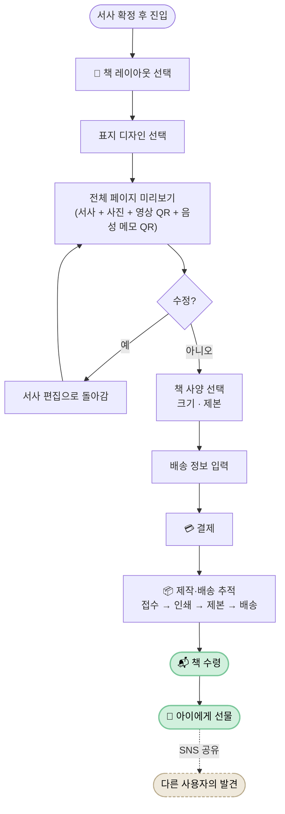

# Book Production Journey — 책 주문 · 배송 · 선물

> 디지털 서사가 실물 책으로 전환되어, 결국 아이의 손에 닿는 마지막 여정. **본 플로우는 디어베이비의 마지막 두 감정 봉우리(책 수령, 아이에게 선물)를 포함하며, 제품 가치 사슬이 완결되는 지점이다.**

| 항목 | 내용 |
|---|---|
| **다루는 단계** | Stage 10 책 주문 → Stage 11 제작·배송 추적 → Stage 12 아이에게 선물 |
| **관련 PRD** | [PRD-004: 실물 책 제작](../prd/PRD-004-book-production.md) |
| **관련 페르소나** | 🌸 Case A · 🌼 Case B · 🌿 Case C 모두 (Case B는 아이별 N권) |
| **앞 플로우로부터 인계** | 확정된 서사 + 통합 미디어 ← [AI Narrative Journey](ai-narrative-journey.md) |
| **다음 플로우로 인계** | (제품 외부 — 사용자가 책을 만지는 물리 영역) → 재참여 시 [Daily Recording Journey](daily-recording-journey.md)로 복귀 |

---

## 개요

AI가 구성한 서사와 사진을 실물 책으로 제작하여 세상에 하나뿐인 아기의 첫 번째 책을 선물로 제공한다. **디지털 기록을 물리적 형태로 영구 보존하는 V-001의 완결, 서사를 책이라는 형태로 결실 맺는 V-003의 완결, 그리고 V-006(실물 책 완성품)의 직접 실현이 본 플로우에 모두 모인다.**

본 플로우의 마지막 모먼트(아이에게 선물)는 SNS로 공유되면서 새로운 사용자의 발견(Onboarding Journey의 Stage 1)으로 이어지는 루프를 닫는다.

---

## 흐름도



---

## 단계별 상세

### Stage 10-1 — 📖 책 레이아웃 · 표지 선택

| 축 | 내용 |
|---|---|
| **사용자 행동** | 여러 책 디자인 템플릿 중 선택 / 표지 디자인 선택 / 내지 레이아웃을 미리보기로 확인 |
| **사용자 감정·생각** | "내 책의 모습을 내가 고른다" — 소유감 / "어떤 디자인이 우리 아이에게 어울릴까" |
| **시스템 응답** | **PRD-004 / AC-004-01** — 다양한 책 디자인 템플릿, 표지 선택, 내지 레이아웃 미리보기 |
| **페인포인트 / 기회** | ⚠️ 옵션이 너무 많으면 결정 피로 / ⚠️ 옵션이 너무 적으면 다양성 부족 → 🌱 큐레이션된 3~5개 템플릿이 적정선 |

### Stage 10-2 — 👀 전체 미리보기

| 축 | 내용 |
|---|---|
| **사용자 행동** | 책의 전체 페이지를 미리보기로 확인. 서사·사진·레이아웃이 통합된 형태로 본다. 영상은 대표 프레임 + QR로, 음성 메모는 QR로 포함됨 |
| **사용자 감정·생각** | **"내가 만든 게 진짜 책이 된다"** — V-006 (실물 책 완성품) 첫 체감 / "이만큼 정성스러운 결과물이라면 가격 정당화" — 본 플로우의 가격 부담을 흡수 |
| **시스템 응답** | **PRD-004 / AC-004-02** — 책 전체 페이지 미리보기, 서사·사진·레이아웃 통합, 영상=대표 프레임+QR, 음성 메모=QR, 제작 전 마지막 수정 가능 |
| **페인포인트 / 기회** | 🌱 미리보기의 완성도가 결제 전환률을 좌우 / 🌱 영상·음성 메모를 QR로 보존하는 방식이 책의 한계를 우아하게 극복 |

### Stage 10-3 — 💳 사양 · 배송 · 결제

| 축 | 내용 |
|---|---|
| **사용자 행동** | 책 크기·제본 방식 선택 → 배송 정보 입력 → 결제 수단 선택 → 결제 |
| **사용자 감정·생각** | "이 가격이 적당할까" — 가격 부담 vs "이만한 결과물이면 충분히 가치 있다" — 미리보기 단계가 흡수해줘야 함 |
| **시스템 응답** | **PRD-004 / AC-004-03** — 책 사양 선택, 배송 정보, 결제 |
| **페인포인트 / 기회** | ⚠️ 가격 부담, 배송 지역 제약 → 🌱 미리보기 단계에서 가치 입증이 충분하면 본 단계 통과율이 올라감 |

### Stage 11 — 📦 제작 · 배송 추적

| 축 | 내용 |
|---|---|
| **사용자 행동** | 접수 → 인쇄 → 제본 → 배송 단계를 앱에서 확인 / 완성 알림 수신 |
| **사용자 감정·생각** | "지금 내 책이 인쇄되고 있다" — 기다림이 설렘으로 작동 / 단계 정체 시 "왜 이렇게 오래 걸리지" — 불안감 |
| **시스템 응답** | **PRD-004 / AC-004-04** — 단계별 상태 확인 (접수/인쇄/제본/배송), 배송 추적, 제작 완료 알림 |
| **페인포인트 / 기회** | ⚠️ 단계 정체 시 불안감 → 🌱 각 단계마다 짧은 카피로 "지금 무엇이 일어나고 있는지" 설명 (예: "장인이 한 페이지씩 제본 중이에요") |

### Stage 12-1 — 📬 책 수령 ★ 세 번째 감정 봉우리

| 축 | 내용 |
|---|---|
| **사용자 행동** | 택배 수령 → 포장 개봉 → 책을 처음 손에 든다 |
| **사용자 감정·생각** | "정말 책이 됐다" — V-006의 직접 체험 / "이게 내 임신/양육의 결정체구나" |
| **시스템 응답** | (제품 외부 — 사용자가 책을 만지는 물리 영역) |
| **페인포인트 / 기회** | 🌱 패키지 디자인이 모먼트의 일부 — 언박싱 자체가 의식이 되도록 / 🌱 인서트 카드("당신의 N개월의 기록입니다")로 모먼트 강화 |

### Stage 12-2 — 🎁 아이에게 선물 ★ 네 번째 감정 봉우리 (가치 사슬 완결)

| 축 | 내용 |
|---|---|
| **사용자 행동** | 책을 아이에게 첫 책으로 선물 (또는 미래의 아이를 위해 보관) / 가족과 공유 |
| **사용자 감정·생각** | **"내가 임신 중에 흘렸던 한 마디 한 마디가, 아이에게 전해진다"** — V-001 (감정 보존)의 가치 사슬이 비로소 완성되는 순간 / "이 책은 평생 남는다" |
| **시스템 응답** | (제품 외부) |
| **페인포인트 / 기회** | 🌱 이 모먼트의 사진/영상이 SNS로 공유되면 [Onboarding Journey](onboarding-journey.md)의 Stage 1 (발견)으로 다른 사용자가 유입되는 루프가 닫힌다 |

---

## 책 형식의 한계와 우아한 극복

본 제품은 디지털 기록(텍스트·사진·영상·음성)을 물리 책으로 전환하는 과정에서 책의 한계를 만난다. 영상과 음성은 종이 위에 직접 표현될 수 없다. PRD-004는 이를 다음과 같이 해결한다.

| 미디어 유형 | 책에서의 표현 | 의미 |
|---|---|---|
| 텍스트 (서사) | 인쇄된 본문 | V-003 결실 |
| 사진 | 인쇄된 이미지 | V-007 결실 |
| 영상 | **대표 프레임 이미지 + QR 코드** (AC-004-02) | 책의 한계를 인정하면서도 영상 접근성 보장 |
| 음성 메모 | **QR 코드를 통한 디지털 재생 링크** (AC-004-02) | 음성의 감정 보존(V-001)을 책 너머로 확장 |

> **이 설계가 의미하는 것**: 책을 펼쳤다가 QR을 스캔해 음성을 재생하는 행위 자체가 사용자에게 "임신 중의 내 목소리를 아이가 듣는다"는 감정 모먼트를 제공한다 — 책의 한계가 오히려 새로운 모먼트로 전환된다.

---

## 사용자 감정 곡선

```
강도 ↑
높음 │                                                  ●(아이 선물 — 가치 사슬 완결)
     │                                                ╱
     │                                              ╱
     │                              ●(책 수령)    ╱
     │                            ╱  ╲          ╱
중간 │       ●(미리보기)         ╱     ╲       ╱
     │      ╱  ╲              ╱        ╲    ╱
     │    ╱      ╲           ╱          ╲ ╱
     │  ●          ╲(가격 부담)        (배송 대기 — 평탄)
낮음 │ (레이아웃)                   
     └────┬────┬────┬────┬────┬────┬────┬────→
       레이   미리   결제   접수   인쇄   배송   수령   선물
        아웃  보기
```

> **곡선의 특징**: 책 수령과 선물은 본 제품 전체 여정의 절정. 미리보기 단계의 봉우리가 결제 전환을 만들고, 수령·선물 단계의 더 높은 봉우리가 재참여·SNS 공유 루프를 만든다.

---

## 페인포인트 & 기회

| # | 단계 | 페인포인트 | 완화 메커니즘 (현재) | 추가 기회 |
|---|---|---|---|---|
| 1 | Stage 10-1 | 결정 피로 (옵션 과다) 또는 다양성 부족 | (균형 필요) | 큐레이션된 3~5개 템플릿 |
| 2 | Stage 10-2 | 미리보기 품질이 낮으면 결제 전환 실패 | AC-004-02 통합 미리보기 | 디지털 미리보기를 인쇄본과 최대한 일치시키기 |
| 3 | Stage 10-3 | 가격 부담 | 미리보기로 가치 입증 | 부분 결제·할부, 출산 선물용 패키지 |
| 4 | Stage 10-3 | 배송 지역 제약 | (PRD에 명시 없음) | 글로벌 배송 단계적 확대 |
| 5 | Stage 11 | 단계 정체 시 불안감 | AC-004-04 단계별 상태 확인 | 각 단계 카피의 따뜻함, 지연 시 능동 알림 |
| 6 | Stage 12-1 | 패키지 디자인이 평범하면 모먼트 약화 | (PRD에 명시 없음) | 언박싱 의식화 — 인서트 카드, 패키지 톤 |
| 7 | Stage 12-2 | 한 번 받고 끝 — 재참여 동기 부재 | (없음 — 미해결) | Case B / 다자녀 양육자에 대한 후속 책 제작 유도, 아이 성장 단계별 시리즈 책 |

---

## 가치 매핑

| 단계 | V-001 감정 보존 | V-003 서사 부여 | V-006 실물 책 | V-007 멀티미디어 |
|---|:---:|:---:|:---:|:---:|
| 10-1. 레이아웃·표지 선택 | ● | ● | ●● | |
| 10-2. 전체 미리보기 | ● | ●● | ●●● | ● |
| 10-3. 사양·배송·결제 | | | ●●● | |
| 11. 제작·배송 추적 | | | ●●● | |
| 12-1. 책 수령 | ●●● | ●●● | ●●● | ● |
| 12-2. 아이에게 선물 | ●●● | ●●● | ●●● | |

> ●●● 핵심 가치 / ●● 보조 가치 / ● 부수 가치

**관찰**: 본 플로우에서 V-006 (실물 책 완성품)이 줄곧 핵심으로 작동한다. 마지막 두 단계(수령·선물)에서 V-001 + V-003 + V-006이 동시에 핵심으로 작동하며 — 이 세 가치가 한 모먼트에 수렴하는 것이 디어베이비의 가치 사슬 완결을 의미한다.

---

## 재참여 루프 (미해결)

본 플로우의 Stage 12 이후 사용자가 다시 [Daily Recording Journey](daily-recording-journey.md)로 복귀하는 동기가 명시적으로 정의되어 있지 않다. 다음은 향후 검토 대상.

| 케이스 | 잠재적 재참여 동기 | 현재 상태 |
|---|---|---|
| Case B 사용자 — 둘째 책 완성 후 첫째 양육 기록 시작 | "둘째에게 만들어줬으니 첫째에게도" | 미정의 |
| Case A → 양육자 모드 → 책 1권 완성 후 | 아이의 다음 단계(돌, 입학 등) 책 시리즈 | 미정의 |
| 다자녀 양육자 | 아이별 책 N권 — 한 명 완성 후 다음 아이 | AC-006-08 아이 전환 탭이 컨텍스트를 보장 |

---

## 가치 사슬 완결 도식

본 플로우에서 디어베이비 전체 여정의 가치 사슬이 닫힌다.

```
임신 중 한 마디 한 마디    →    AI 서사로 엮임    →    실물 책으로 결실    →    아이에게 닿음
   (V-001 감정 보존)           (V-003 서사 부여)        (V-006 실물 책)         (V-001 완결)

   Daily Recording        →     AI Narrative      →    Book Production      →     Gift
                                                          (Stage 10~11)         (Stage 12)
```

> 이 도식이 PRD/AC가 약속한 가치를 사용자가 끝까지 체험했다는 증거다. 본 플로우의 완결은 곧 디어베이비 제품 약속의 이행이다.

---

## 관련 문서

- [`prd/PRD-004-book-production.md`](../prd/PRD-004-book-production.md) — 실물 책 제작
- [`values/product-values.md`](../values/product-values.md) — V-006 실물 책 완성품
- [← 이전 플로우: AI Narrative Journey](ai-narrative-journey.md)
- [↺ 재참여 시: Daily Recording Journey](daily-recording-journey.md)
- [← 인덱스로 돌아가기](README.md)
