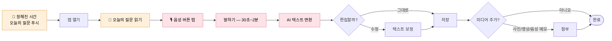

# Daily Recording Journey — 홈 첫 진입 · 일상 기록 루틴

> 사용자가 홈에 처음 진입한 순간부터, 매일 음성 한 마디를 남기는 일상 루틴이 정착되기까지의 여정. **본 플로우는 임신 ~10개월의 가장 긴 구간을 차지한다.**

| 항목 | 내용 |
|---|---|
| **다루는 단계** | Stage 5 홈 첫 진입 → Stage 6 일상 기록 루틴 (반복) |
| **관련 PRD** | [PRD-001 (음성 일기)](../prd/PRD-001-voice-diary.md), [PRD-002 (오늘의 질문)](../prd/PRD-002-daily-questions.md), [PRD-005 (미디어 통합)](../prd/PRD-005-media-records.md), [PRD-006 (다자녀 컨텍스트)](../prd/PRD-006-onboarding-cases.md), [PRD-007 (홈 화면 구성)](../prd/PRD-007-home-screen.md), [PRD-008 (일기 탭 — 일기 목록)](../prd/PRD-008-diary-list.md) |
| **관련 페르소나** | 🌸 Case A · 🌼 Case B · 🌿 Case C 모두 (양육자 모드도 같은 루틴) |
| **앞 플로우로부터 인계** | 케이스 · 활성 아이 정보 · 임신 주차/양육 일수 · 일기 목적 · 다자녀 여부 ← [Onboarding Journey](onboarding-journey.md) 또는 [Birth Conversion Journey](birth-conversion-journey.md) |
| **다음 플로우로 인계** | 충분히 쌓인 기록 (음성·텍스트·미디어) · 임신/양육 컨텍스트 → [AI Narrative Journey](ai-narrative-journey.md) 또는 [Birth Conversion Journey](birth-conversion-journey.md) (Case A·B만) |

---

## 개요

이 플로우가 매끄러우면 책이 풍성해지고, 막히면 책이 비게 된다. **디어베이비의 운명을 좌우하는 단계.** 객관적으로 평탄한 구간이라 권태·이탈 위험이 가장 크고, 그 위험을 **푸시 알림 + 오늘의 질문**(PRD-002)이 지탱한다.

본 플로우는 임신 모드와 양육자 모드 모두에 적용되며, 두 모드의 구조적 차이는 거의 없다. 다만 컨텍스트(임신 주차 vs 양육 일수)와 활성 아이가 바뀌면서 표시 정보가 달라진다.

---

## 흐름도

### 홈 첫 진입 (Stage 5)

```mermaid
flowchart TD
    Enter([온보딩 직후<br/>홈 첫 진입]) --> Home["🏠 홈 화면<br/>(a) 오늘의 질문 카드<br/>(b) 임신 주차 / 양육 일수<br/>(c) 음성으로 기록 버튼"]
    Home --> Multi{다자녀<br/>(Case B 등)?}
    Multi -- 예 --> Switch[홈 상단<br/>◀ 아이 이름 ▶ 전환 탭]
    Multi -- 아니오 --> Single[단일 아이 컨텍스트]
    Switch --> Ready([일상 루틴 진입 준비])
    Single --> Ready

    classDef peak fill:#d1f0dd,stroke:#7ac79a,stroke-width:1.5px,color:#000
    class Home peak
```

### 일상 기록 루프 (Stage 6 — 매일 반복)



---

## 단계별 상세

### Stage 5 — 🏠 홈 첫 진입

| 축 | 내용 |
|---|---|
| **사용자 행동** | 홈 화면에서 (a) 오늘의 질문 카드 (b) 임신 주차 표시 또는 양육 일수 (c) "음성으로 기록" 버튼을 본다. 다자녀라면 상단의 ◀ 아이 전환 탭 ▶도 본다 |
| **사용자 감정·생각** | "오늘의 질문이 있으니까 뭘 말해야 할지 고민 안 해도 되겠다" — V-002 (기록 부담 제거) 첫 체감 / (Case B) "두 아이 모두 한 화면에서 전환 가능하다" |
| **시스템 응답** | **PRD-002 / AC-002-01·02** — 출산 예정일 기반 임신 주차 계산 → 해당 주차 질문 풀에서 매일 새 질문 표시 / **PRD-006 / AC-006-08** — 다자녀(Case B) 사용자에겐 홈 상단에 아이 전환 탭 노출 / **AC-006-09** — 활성 아이 기준으로 홈/일기/커뮤니티/자서전 모두 재구성 |
| **페인포인트 / 기회** | ⚠️ 첫 진입 시 기록이 0건이라 화면이 비어 보일 수 있음 → 🌱 오늘의 질문이 "첫 한 마디"의 진입로 역할을 한다 |

### Stage 6 — 🎙️ 일상 기록 루틴 (Daily Loop)

| 축 | 내용 |
|---|---|
| **사용자 행동** | 푸시 알림 → 앱 진입 → 오늘의 질문 확인 → 음성 30초~2분 → AI 변환 결과 확인 → (필요 시) 텍스트 편집 → (선택) 사진/영상/음성 원본 첨부 → 저장 |
| **사용자 감정·생각** | "딱 한 마디만 하면 되네" / "변환이 꽤 정확하다" / "이 사진 같이 넣으면 더 의미 있겠다" / (반복 일수가 길어지면) "오늘 할 말이 딱히 없는데..." |
| **시스템 응답** | **PRD-001** — 음성 녹음·STT·편집·저장·목록 (AC-001-01~05) / **PRD-002** — 질문에서 바로 기록 진입, 푸시 알림 (AC-002-03·04) / **PRD-005** — 사진·영상·음성 메모 첨부 (AC-005-01~07) / **PRD-006 / AC-006-09** — 새 기록 작성 시 기본 대상 아이는 활성 아이로 자동 지정 (변경 가능) |
| **페인포인트 / 기회** | ⚠️ STT 정확도, 음성 녹음 중 끊김, "오늘 할 말이 없는데"라는 무력감 → 🌱 질문이 "무엇을 말할지" 부담을 거의 다 흡수해주면 루프가 산다 |

#### 임신 모드 vs 양육자 모드 차이

| 축 | 임신 모드 | 양육자 모드 (출산 후 / Case C) |
|---|---|---|
| 시간 표시 | 임신 N주 D일 | 출생 N일째 / N개월째 |
| 오늘의 질문 풀 | 임신 주차별 질문 (PRD-002) | (별도 풀 또는 동일 질문 풀) |
| 첨부 미디어 톤 | 산부인과 사진, 배 사진 | 아이 얼굴 사진, 영상 |
| 기록의 수신자 | 미래의 아이 ("너에게 전하는 말") | 현재의 아이 |

---

## 사용자 감정 곡선 (본 플로우 안에서)

```
강도 ↑
높음 │ ●(첫 음성 한 마디 — 가능성 체감)
     │  ╲                                                       ●(매일 푸시에 응답하는 습관 정착)
     │   ╲                                                   ╱
중간 │    ╲   ───── 일상 루틴: 평탄하지만 깊어짐 ─────       ╱
     │     ╲              ↑ 푸시 알림이 동력                ╱
     │      ╲      ⚠ 권태·이탈 위험 구간                 ╱
낮음 │       ╲_______________________________________╱
     └────┬────┬────┬────┬────┬────┬────┬────┬────→ 시간 (주 단위)
       홈첫    1주  2주  4주  6주  8주  10주 ...    출산임박
       진입
```

> **이 곡선이 의미하는 것**: 첫 한 마디의 흥분은 1~2주 안에 사라진다. 그 후의 평탄 구간을 푸시 알림 + 오늘의 질문이 지탱한다. 본 플로우의 길이가 길수록 다음 플로우(서사 생성·책 제작)의 결과물이 풍성해진다.

---

## 페인포인트 & 기회

| # | 단계 | 페인포인트 | 완화 메커니즘 (현재) | 추가 기회 |
|---|---|---|---|---|
| 1 | Stage 5 | 첫 진입 시 빈 화면 인상 | 오늘의 질문이 즉시 진입로 제공 | 첫 진입 전용 환영 메시지 |
| 2 | Stage 6 | "오늘 할 말이 없다" 무력감 | PRD-002 오늘의 질문 (AC-002-03) | 주차별 질문 다양성 점검, 사용자가 직접 질문 만들기 |
| 3 | Stage 6 | STT 부정확 시 편집 부담 | AC-001-03 텍스트 편집 | 음성 원본 보존(AC-005-05)으로 안전장치 제공 |
| 4 | Stage 6 (Case B 다자녀) | 잘못된 아이 컨텍스트에 기록 | AC-006-08·09 활성 아이 표시 | 새 기록 화면 상단에 "지금 [아이 이름]에게 기록 중"을 시각적으로 강조 |
| 5 | Stage 6 | 푸시 권한 거부 시 루프 동력 손실 | (PRD-006 비기능 요구사항) | 인앱 알림·이메일 알림 등 백업 채널 |
| 6 | Stage 6 | 장기간 기록 누락 후 복귀 부담 ("오랜만이라 어색해") | (없음) | 복귀 사용자 전용 부드러운 카피 |

---

## 가치 매핑

| 단계 | V-001 감정 보존 | V-002 부담 제거 | V-004 음성-텍스트 | V-005 주차 맞춤 | V-007 멀티미디어 |
|---|:---:|:---:|:---:|:---:|:---:|
| 5. 홈 첫 진입 | ● | ●● | | ●● | |
| 6. 일상 루틴 | ●●● | ●●● | ●●● | ●● | ●● |

> ●●● 핵심 가치 / ●● 보조 가치 / ● 부수 가치

**관찰**: 본 플로우는 V-001 (감정 보존)·V-002 (부담 제거)·V-004 (음성-텍스트)가 동시에 작동하는 디어베이비의 **핵심 가치 4중주** 구간이다. 이 구간이 약하면 제품의 정체성 자체가 무너진다.

---

## 다음 플로우로의 인계

본 플로우는 두 갈래로 분기될 수 있다.

| 분기 조건 | 다음 플로우 | 인계 항목 |
|---|---|---|
| Case A·B 사용자 + 출산 예정일 D-7 도달 | [Birth Conversion Journey](birth-conversion-journey.md) | 임신 컨텍스트, 예정일, 누적된 기록 |
| 일정 기간 기록 누적 (또는 사용자 요청) | [AI Narrative Journey](ai-narrative-journey.md) | 누적된 음성 일기·텍스트·미디어 |

> Case C 사용자는 출산 전환 분기를 거치지 않고 본 플로우와 AI 서사 플로우 사이를 직접 오간다.

---

## 관련 문서

- [`prd/PRD-001-voice-diary.md`](../prd/PRD-001-voice-diary.md) — 음성 일기 기능
- [`prd/PRD-002-daily-questions.md`](../prd/PRD-002-daily-questions.md) — 오늘의 질문
- [`prd/PRD-005-media-records.md`](../prd/PRD-005-media-records.md) — 미디어 첨부
- [`prd/PRD-006-onboarding-cases.md`](../prd/PRD-006-onboarding-cases.md) — 다자녀 컨텍스트 (AC-006-08·09)
- [`prd/PRD-007-home-screen.md`](../prd/PRD-007-home-screen.md) — 홈 화면 구성 (Stage 5·6의 시각·구조 명세)
- [`prd/PRD-008-diary-list.md`](../prd/PRD-008-diary-list.md) — 일기 탭 / 일기 목록 화면 (사용자가 과거 일기를 다시 보는 공간; 본 여정의 "쓰기" 와 짝을 이루는 "다시 보기" 표면)
- [← 이전 플로우: Onboarding Journey](onboarding-journey.md)
- [→ 다음 플로우 (Case A·B): Birth Conversion Journey](birth-conversion-journey.md)
- [→ 다음 플로우 (Case C 또는 출산 후): AI Narrative Journey](ai-narrative-journey.md)
- [← 인덱스로 돌아가기](README.md)
