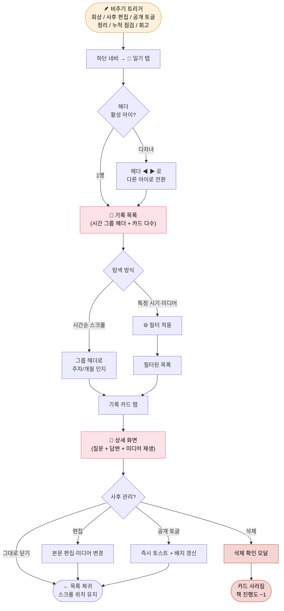

# Diary Browsing Journey — 누적된 기록을 다시 만나는 여정

> 사용자가 일기 탭에 들어와 과거 자신이 남긴 기록을 다시 보고, 다듬고, 정리하는 여정. Daily Recording Journey의 **곁가지 루프**로, 작성과 같은 빈도로 발생하지 않지만 **V-001 (감정 보존)을 진짜 보존으로 완성하는** 결정적 통로다.

| 항목 | 내용 |
|---|---|
| **다루는 단계** | Stage 6½ 일기 탐색 (Daily Recording과 평행, 비주기 트리거) |
| **관련 PRD** | [PRD-008 (일기 탭)](../prd/PRD-008-diary-tab.md), [PRD-001 (음성 일기 — 편집)](../prd/PRD-001-voice-diary.md), [PRD-005 (미디어)](../prd/PRD-005-media-records.md), [PRD-006 (다자녀 컨텍스트)](../prd/PRD-006-onboarding-cases.md), [PRD-007 (헤더·네비)](../prd/PRD-007-home-screen.md) |
| **관련 페르소나** | 🌸 Case A · 🌼 Case B · 🌿 Case C 모두 — 단, Case B 다자녀 양육자의 사용 빈도가 가장 높다 (아이별 기록을 분리해서 다시 봐야 하므로) |
| **앞 플로우로부터 인계** | 누적된 기록 (텍스트·미디어·공개 여부) · 활성 아이 컨텍스트 ← [Daily Recording Journey](daily-recording-journey.md) |
| **다음 플로우로 인계** | 사용자가 정리·다듬어둔 기록 → [AI Narrative Journey](ai-narrative-journey.md) (사후 편집·정리가 서사 품질에 직접 기여) |

---

## 개요

일상 기록 루틴(Stage 6)이 **"작성"** 행위라면 본 여정은 **"재방문"** 행위다. 사용자는 다음과 같은 비주기적 트리거로 일기 탭에 들어온다.

- 며칠/몇 주 전 한 마디를 떠올리고 싶을 때 (감정적 회상)
- 작성 직후 미처 정리하지 못한 오타·문장을 다듬고 싶을 때 (사후 편집)
- 비공개로 둔 기록을 가족과 공유하고 싶어 공개로 전환할 때 (공개 토글)
- 너무 사적이라 후회되는 기록을 비공개·삭제하려고 할 때 (정리·삭제)
- AI 서사 생성을 앞두고 "어느 정도 모였지?" 확인하고 싶을 때 (누적 점검)
- 출산 임박 / 책 만들기 직전, 임신 기간 전체를 훑어보고 싶을 때 (회고)

이 여정의 매끄러움이 **V-001 (감정 보존)의 진짜 완성도**를 결정한다. 작성만 잘 되고 다시 찾기 어렵다면, "보존됐다"는 사용자의 체감은 깨진다.

---

## 흐름도



---

## 단계별 상세

### Stage 6½-1 — 🪶 일기 탭 진입

| 축 | 내용 |
|---|---|
| **사용자 행동** | 하단 네비에서 일기 탭(📓) 탭. 진입 즉시 활성 아이의 시간순 기록 목록을 본다. 다자녀라면 헤더의 ◀ ▶로 보려는 아이로 전환한다 |
| **사용자 감정·생각** | "그때 내가 뭐라고 했지?" / "쟁여둔 기록이 이만큼이구나" / (Case B 다자녀) "지금은 하준이 거 보고 있구나, 서연이 거 봐야지" |
| **시스템 응답** | **PRD-008 / AC-008-01** — 활성 아이 기준 기록만 표시, 아이 전환 시 즉시 갱신 / **AC-008-02** — 시간 그룹 헤더(주차/개월) sticky 표시 / **AC-008-09** — 기록 0건이면 안내 + `홈으로 가기` CTA |
| **페인포인트 / 기회** | ⚠️ 신규 사용자가 기록 0건 상태로 들어오면 빈 화면 인상 → 🌱 빈 상태 카피와 홈 CTA가 첫 작성으로 부드럽게 유도 / ⚠️ 다자녀가 어느 아이를 보는지 헷갈리는 순간 → 🌱 헤더의 활성 아이 이름이 상수 표시 |

### Stage 6½-2 — 📜 시간 그룹 인지와 스크롤

| 축 | 내용 |
|---|---|
| **사용자 행동** | 목록을 스크롤하며 그룹 헤더(`임신 28주차 · 2025년 11월`)로 시간 위치를 가늠한다. 특정 시기를 찾는 경우 ⚙ 필터로 기간·미디어·공개 여부를 좁힌다 |
| **사용자 감정·생각** | "28주차 즈음에 그 이야기를 했었지" / "사진 첨부한 것만 보고 싶다" / "지난 한 달치만 훑어보자" |
| **시스템 응답** | **AC-008-02** — 임신 주차 / 양육 개월·나이 단위 그룹, 12개월 경계에서 자동 분기, 출산 전환을 가로지르는 활성 아이는 두 모드 그룹이 시각 구분선과 함께 연결 / **AC-008-08** — 필터 시트(기간·미디어 칩 다중 선택·공개 여부), 적용 시 즉시 갱신, 필터 배지로 적용 상태 노출 |
| **페인포인트 / 기회** | ⚠️ 기록이 100건+ 누적되면 시간 스크롤만으로는 못 찾음 → 🌱 필터가 누적 사용자에게 필수 도구 / ⚠️ 그룹 헤더가 너무 자주 나오면 시각 잡음 → 🌱 sticky로 처리해 스크롤 중에도 위치 감각 유지 |

### Stage 6½-3 — 📄 한 기록의 상세 만남

| 축 | 내용 |
|---|---|
| **사용자 행동** | 카드를 탭해 상세 화면 진입. 질문·답변 전문·첨부 미디어(사진·영상 인라인, 음성 메모 재생 컨트롤)를 본다. 음성 원본이 있으면 그 시점 자기 목소리도 다시 듣는다 |
| **사용자 감정·생각** | "아 그래, 이때 회의 중에 태동을 처음 느꼈지" / "내 목소리가 그땐 이렇게 떨렸구나" / "사진은 이거였구나" — **감정의 재현 모먼트** |
| **시스템 응답** | **AC-008-04** — 상단 메타(작성일·주차/개월·공개 배지) · 본문 인용 스타일 질문 · 전체 텍스트 · 첨부 미디어 / **PRD-005** — 미디어 재생 동작 / 음성 원본 진입점 노출 |
| **페인포인트 / 기회** | ⚠️ 미디어 로딩 지연으로 감정 흐름 깨짐 → 🌱 텍스트 우선 표시, 미디어 progressive 로딩 (후속 검토) / 🌱 음성 원본 재생이 **본 여정에서 가장 감정적인 모먼트** — 텍스트로는 못 살린 떨림·웃음을 복원한다 |

### Stage 6½-4 — ✏️ 사후 관리 (선택)

| 축 | 내용 |
|---|---|
| **사용자 행동** | 상세 화면의 `⋯` → 편집·삭제·공개 토글 액션 시트 사용. 편집 화면에서 본문·미디어·공개 여부를 다듬고 저장. 삭제는 확인 모달을 한 번 거친다 |
| **사용자 감정·생각** | "이 부분 오타 좀 고치자" / "이건 너무 사적이라 비공개로 바꾸자" / "이 기록은 너무 부정적이라 지우고 싶다" / (삭제 직전 망설임) "근데 진짜 지워도 될까?" |
| **시스템 응답** | **AC-008-05** — 본문·미디어·공개 토글은 변경 가능, 작성일·질문·임신주차·음성 원본은 불변 / **AC-008-06** — 삭제는 확인 모달, 영구 삭제, 책 진행도에서 차감, 토스트 노출 / **AC-008-07** — 공개/비공개 즉시 토글, 토스트, 공감 수 보존 |
| **페인포인트 / 기회** | ⚠️ 삭제 후 후회 ("그래도 남겨둘 걸") → 🌱 후속 검토 — N일간 휴지통 복구 / ⚠️ 사후 편집이 작성 시 음성-텍스트 정합성을 깨뜨릴 수 있음 → 🌱 음성 원본은 불변으로 보호 (편집은 텍스트만), 사용자가 "내 목소리 그대로"라는 안전감을 가짐 |

---

## 임신 모드 vs 양육자 모드 vs 다자녀 차이

| 축 | 임신 모드 | 양육자 모드 | 다자녀 (Case B) |
|---|---|---|---|
| 그룹 헤더 | `임신 NN주차 · YYYY년 MM월` | 12개월 이하 `생후 NN개월`, 13개월 이상 `NN살` | 활성 아이별로 위 둘 중 해당 형식 |
| 출산 전환 그룹 | (없음, 임신 그룹만) | (없음, 양육 그룹만) | 임신 → 양육 두 그룹이 시각 구분선으로 연결 |
| 헤더 화살표 | 비활성 (단일 아이) | 비활성 (단일 아이) | **활성** (◀ ▶ 으로 아이 전환) |
| 핵심 동기 | 출산 직전 회고 · AI 서사 직전 누적 점검 | 첫돌 / 일정 시점 회고 · 책 제작 직전 점검 | "두 아이 모두 공평하게 기록됐는지" 점검 |

---

## 사용자 감정 곡선 (본 여정 안에서)

```
강도 ↑
높음 │              ●(음성 원본 재생 — 그때 그 목소리)
     │              │ ╲
     │              │  ╲  ●(공개 전환 후 가족에게 공유)
     │            ╱ │   ╲ ╱
중간 │   ●(목록 진입 — 누적의 시각화)              ●(다듬은 후 깔끔해진 만족)
     │  ╱           │                            ╱
     │ ╱            │     ⚠ 삭제 직전 망설임   ╱
낮음 │╱             │           ╲             ╱
     │              ●(상세 진입)  ●(삭제 후 후회 ← 후속 검토)
     └────┬────┬────┬────┬────┬────┬────┬───→ 본 여정 내 단계
       진입  스크롤  카드탭 상세    편집   삭제  공개
                          (재현) (정리)
```

> **이 곡선의 의미**: 본 여정의 정서적 정점은 **"음성 원본 재생"** 모먼트다. 텍스트만으로는 못 살리는 그 시점 자기 목소리의 떨림·웃음·울먹임이 V-001 (감정 보존)을 비로소 "보존됐다"로 체감하게 한다. 반대 극은 삭제 직전 망설임 — 비가역 동작의 안전장치가 사용자 신뢰를 결정한다.

---

## 페인포인트 & 기회

| # | 단계 | 페인포인트 | 완화 메커니즘 (현재) | 추가 기회 |
|---|---|---|---|---|
| 1 | 진입 | 신규 사용자 0건 빈 화면 인상 | AC-008-09 빈 상태 안내 + `홈으로 가기` CTA | 첫 진입 코치마크 (어떤 동작을 할 수 있는지 1회 안내) |
| 2 | 스크롤 | 누적 100건+ 시 시간 스크롤만으로 못 찾음 | AC-008-08 필터 (기간·미디어·공개 여부) | 텍스트 검색 (후속 검토), 캘린더 뷰 (후속 검토) |
| 3 | 다자녀 탐색 | 어느 아이의 기록을 보고 있는지 헷갈림 | AC-008-01 헤더 활성 아이 이름 상수, 전환 시 즉시 갱신 + 스크롤 리셋 | 활성 아이 색상 톤을 화면 어딘가에 약하게 반영 |
| 4 | 상세 | 미디어 다수 첨부 시 로딩 지연 | (현재 명세 없음) | progressive 로딩 — 텍스트 먼저, 미디어 점진 (후속 검토) |
| 5 | 편집 | 작성 시 의도와 사후 편집 결과의 정합성 깨짐 | AC-008-05 작성일·질문·임신주차·음성 원본 불변 | 편집 이력 표시 (후속 검토) |
| 6 | 삭제 | 영구 삭제 후 후회 | AC-008-06 확인 모달 + 위험 강조 색상 | 휴지통 + N일 복구 (후속 검토) |
| 7 | 공개 토글 | 공개 → 비공개 시 누적 공감 수 손실 우려 | AC-008-07 공감 수 데이터 보존, 재공개 시 복원 | 공개 전환 시 "누가 볼 수 있는지" 한 줄 안내 |

---

## 가치 매핑

| 단계 | V-001 감정 보존 | V-002 부담 제거 | V-003 서사 부여 | V-007 멀티미디어 |
|---|:---:|:---:|:---:|:---:|
| 1. 일기 탭 진입 | ● | ●● | ● | |
| 2. 시간 그룹 스크롤 | ●● | ● | ●●● | |
| 3. 한 기록 상세 (재현) | ●●● | | ●● | ●●● |
| 4. 사후 관리 | ●● | ●●● | | ● |

> ●●● 핵심 가치 / ●● 보조 가치 / ● 부수 가치

**관찰**:
- **V-001 (감정 보존)**은 본 여정 전체의 동력. 특히 상세 화면의 음성 원본 재생 모먼트에서 정점 — "다시 만날 수 있어야 진짜 보존이다"
- **V-003 (서사 부여)**는 시간 그룹 헤더(주차·개월·나이)가 만드는 **준-서사** 효과 — AI 서사 생성(플로우 4) 이전에도 시간 축 정리만으로 일부 서사 효과를 제공한다
- **V-007 (멀티미디어)**는 작성(플로우 2)에서 수집되고, 본 여정의 상세 화면에서 비로소 "다시 본다·다시 듣는다"라는 형태로 가치가 실현된다
- **V-002 (부담 제거)**는 사후 관리 단계에 집중 — "작성 시점에 완벽하지 않아도 된다, 나중에 다듬으면 된다"는 안전감

---

## Daily Recording Journey와의 관계

본 여정은 [Daily Recording Journey](daily-recording-journey.md)와 **시간 축이 다르다**.

- Daily Recording: 매일 / 매주 정기적 (푸시 알림이 트리거)
- Diary Browsing (본 여정): 비주기적, 사용자 내적 동기로만 진입

따라서 푸시 알림 같은 시스템적 동력이 없다. 본 여정의 진입은 사용자가 **"다시 만나고 싶다"**, **"다듬고 싶다"**, **"공유하고 싶다"**는 내적 동기에 전적으로 의존한다. 이는 본 여정의 매끄러움이 사용자 체감 만족도에 직접 영향을 준다는 뜻이다 — 한 번 들어와서 원하는 동작이 막히면 다음 진입까지의 간격이 길어지고, 그게 길어지면 **V-001 보존의 체감 가치**가 사라진다.

---

## 다음 플로우로의 인계

본 여정은 두 플로우에 간접 기여한다.

| 인계 대상 | 인계 항목 | 인계 메커니즘 |
|---|---|---|
| [AI Narrative Journey](ai-narrative-journey.md) | 사용자가 사후 편집·정리·삭제로 다듬어둔 기록 세트 | 본 여정의 사후 관리(Stage 6½-4)는 AI 서사 입력 품질을 직접 끌어올린다. 오타·중복·후회 기록을 정리해두면 서사가 더 매끄럽다 |
| [Book Production Journey](book-production-journey.md) | 책에 포함되는 기록의 최종 공개·삭제 상태 | 책 제작 직전 본 여정에서 한 번 더 훑고 다듬는 사용자가 많을 것으로 예상 — "이건 책에 들어가도 괜찮나?" 점검 동선 |

또한 책 제작이 끝난 후에도 본 여정은 **재참여 루프의 진입점**이 될 수 있다 — Case B 다자녀 양육자가 다른 아이의 기록을 보러 일기 탭에 들어오는 동선.

---

## 관련 문서

- [`prd/PRD-008-diary-tab.md`](../prd/PRD-008-diary-tab.md) — 일기 탭 화면 구성 (본 여정의 시각·동작 명세)
- [`prd/PRD-001-voice-diary.md`](../prd/PRD-001-voice-diary.md) — 음성 일기 (작성·편집)
- [`prd/PRD-005-media-records.md`](../prd/PRD-005-media-records.md) — 미디어 통합 (상세 화면 미디어 재생)
- [`prd/PRD-006-onboarding-cases.md`](../prd/PRD-006-onboarding-cases.md) — 다자녀 컨텍스트 (AC-006-09)
- [`prd/PRD-007-home-screen.md`](../prd/PRD-007-home-screen.md) — 헤더·네비 공유 명세
- [← 평행 플로우: Daily Recording Journey](daily-recording-journey.md)
- [→ 후속 플로우 (간접): AI Narrative Journey](ai-narrative-journey.md)
- [→ 후속 플로우 (간접): Book Production Journey](book-production-journey.md)
- [← 인덱스로 돌아가기](README.md)
