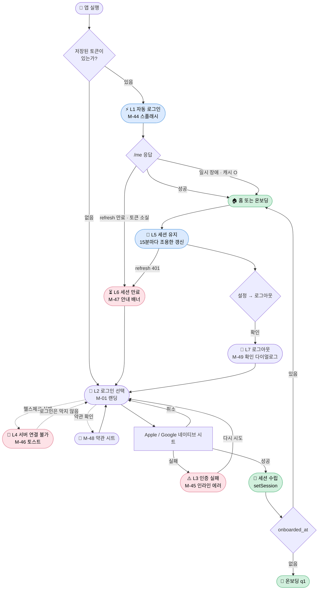

# Login & Session Journey — 로그인 · 세션 유지 · 재로그인 · 로그아웃

> 사용자가 계정으로 앱에 들어오고, 머무르고, 밀려나고, 스스로 나가기까지의 여정. 다른 여정들이 "무엇을 남기는가"를 다룬다면, 본 여정은 **"남긴 것에 계속 닿을 수 있는가"**를 다룬다.

| 항목 | 내용 |
|---|---|
| **다루는 단계** | L1 자동 로그인 → L2 로그인 선택 → L3 인증 실패 → L4 서버 연결 불가 → L5 세션 유지 → L6 세션 만료 → L7 로그아웃 (+ 부록: 테스터 로그인) |
| **관련 PRD** | **없음** — 아래 "왜 이 여정에는 PRD가 없는가" 참조 |
| **관련 엔지니어링 노트** | [ENG-003 클라이언트 로그인 과정](../engineering/ENG-003-client-login-process.md) · [ENG-006 클라이언트 로그아웃 과정](../engineering/ENG-006-client-logout-process.md) |
| **관련 화면** | M-01 ([`mockups/`](../mockups)) · **M-44 ~ M-50 은 본 문서가 요구사항으로 정의하며 후속 PR 에서 신설된다** (아래 "아직 없는 화면" 참조) |
| **관련 페르소나** | 🌸 Case A · 🌼 Case B · 🌿 Case C 모두 (케이스와 무관) |
| **앞 플로우로부터 인계** | (없음 — 앱 실행이 트리거) |
| **다음 플로우로 인계** | 인증 상태(`authenticated` / `onboarding` / `unauthenticated`) → [Onboarding Journey](onboarding-journey.md) 또는 [Daily Recording Journey](daily-recording-journey.md) |

---

## 개요

로그인은 **한 번 하고 끝나는 관문이 아니라, 앱을 여는 모든 순간에 반복 통과하는 루프**다. 사용자 관점에서 이 여정의 성패는 두 가지로 갈린다.

1. **평소에는 존재를 느끼지 않게 하는가** — 재방문의 99%는 스플래시(M-44)를 스치고 홈으로 간다. 성공한 로그인은 화면이 아니라 부재(不在)로 체험된다.
2. **어긋났을 때 설명하는가** — 실패·순단·만료는 드물지만, 그 순간 아무 설명이 없으면 사용자는 "앱이 고장났다" 또는 "내 기록이 사라졌다"로 해석한다.

본 여정 문서가 다루는 페인포인트는 대부분 **2번**에 몰려 있다. ENG-003 §10과 ENG-006 §8이 코드 관점에서 관찰한 "사용자에게 아무것도 보이지 않는" 지점들을, 본 문서와 M-44~M-50이 사용자 관점의 화면과 카피로 옮긴다.

### 왜 이 여정에는 PRD가 없는가

[`journeys/README.md`](README.md)의 문서 분할 원칙은 각 여정이 PRD 1~2개와 1:1 매핑되기를 요구하지만, **본 여정은 유일한 예외**다.

[`doc-tracker.md`](../doc-tracker.md)가 명시하듯 *"인증은 사용자에게 보이는 제품 기능이 아니라 기록 귀속·세션 유지를 떠받치는 기반이라, PRD/AC 가 아니라 엔지니어링 노트(ENG-003)로 관리한다."* 따라서 본 여정은 PRD/AC 대신 **ENG-003 · ENG-006에 매핑**되며, 대응하는 TEST 문서도 두지 않는다(e2e는 `login.yaml`이 ENG-003에 직접 매핑).

이 예외가 의미하는 바: 본 여정에서 제기되는 페인포인트는 AC 신설이 아니라 **ENG 노트의 관찰 항목 해소**로 이어진다. 다만 그 해소의 시각적 목표(to-be)는 mockup이 정의하며, 그것이 M-44~M-50의 존재 이유다.

### 아직 없는 화면 — M-44 ~ M-50

**본 문서 시점에 M-44~M-50 은 아직 레포에 없다.** 본 문서가 그 7개 화면의 요구사항(어느 stage의 어떤 상태를, 어떤 카피로)을 정의하고, 실제 mockup 소스·번들·인덱스 편입은 후속 PR에서 이뤄진다. 지금 `docs/mockups/` 에서 M-44 를 찾으면 없는 것이 정상이다.

| 예정 ID | 화면 | 대응 stage | 현재 구현 |
|---|---|---|:---:|
| M-44 | 스플래시 — 자동 로그인 확인 중 | L1 | 🟡 부분 (카피·인디케이터 없음) |
| M-45 | 랜딩 — 로그인 실패 인라인 에러 | L3 | 🔴 없음 |
| M-46 | 랜딩 — 서버 연결 불가 토스트 | L4 | ✅ 있음 |
| M-47 | 랜딩 — 세션 만료 재로그인 안내 | L6 | 🔴 없음 |
| M-48 | 약관 · 개인정보 처리방침 시트 | L2 | 🔴 없음 (링크가 눌리지 않음) |
| M-49 | 설정 — 로그아웃 확인 다이얼로그 | L7 | ✅ 있음 |
| M-50 | 테스터 로그인 모달 | 부록 | ✅ 있음 |

> 아래 본문에서 `M-4x` 는 모두 **이 표의 예정 화면**을 가리킨다. 후속 PR이 병합되면 이 절을 지우고 헤더의 "관련 화면" 행을 실제 링크로 바꾼다.

---

## 흐름도



> **읽는 법**: 파란 노드(L1·L5)는 **사용자가 알아채지 못해야 성공**인 구간이고, 분홍 노드(L3·L4·L6)는 **알아채게 만들어야 성공**인 구간이다. 지금 구현은 파란 구간은 잘 하고 있고, 분홍 구간이 비어 있다.

---

## 단계별 상세

각 단계를 ① **사용자 행동** ② **사용자 감정·생각** ③ **시스템 응답 (ENG 매핑)** ④ **페인포인트 / 기회** 4축으로 정리한다.

### L1 — ⚡ 자동 로그인 (재방문 · 콜드 스타트) · M-44

| 축 | 내용 |
|---|---|
| **사용자 행동** | 홈 화면에서 앱 아이콘을 탭한다. 그 외 아무것도 하지 않는다 |
| **사용자 감정·생각** | (아무 생각 없음 — 이것이 성공 상태다) / 1초를 넘기면 "왜 안 열리지?" |
| **시스템 응답** | **ENG-003 §2** — `status='loading'` 동안 AuthGate는 리다이렉트하지 않는다. SecureStore의 access 토큰으로 `GET /v1/me` 호출(만료 시 401→refresh 자동 회복). 성공하면 `onboarded_at` 유무로 홈/온보딩 분기 |
| **페인포인트 / 기회** | ⚠️ 네트워크가 느리면 "기록을 열고 있어요" 없이 로고만 떠 있는 정지 화면이 된다 → 🌱 M-44가 **살아 있음의 신호**(펄스 인디케이터 + 카피)를 준다. 진행률은 주지 않는다 — 알 수 없는 값을 지어내지 않기 위함 |

### L2 — 🚪 로그인 선택 (첫 진입 · 재로그인) · M-01 · M-48

| 축 | 내용 |
|---|---|
| **사용자 행동** | Apple 또는 Google 버튼을 1탭 → 네이티브 시트에서 계정 확인 |
| **사용자 감정·생각** | "복잡한 가입 절차였으면 그냥 닫았을 텐데, 다행이다" / (재로그인이라면) "비밀번호를 기억 못 해도 되네" |
| **시스템 응답** | **ENG-003 §3.1·3.2** — 네이티브 SDK 자격 증명을 `POST /v1/auth/apple` 또는 `/v1/auth/google`로 교환 → 자체 JWT 쌍 + `user` 수신 → `setSession()` |
| **페인포인트 / 기회** | ⚠️ Apple 버튼은 iOS에서만, Google 버튼은 클라이언트 ID가 설정된 빌드에서만 렌더된다 — **둘 다 없는 빌드에서는 로그인 수단이 하나도 없는 랜딩**이 나온다 (웹 빌드가 이 상태) / ⚠️ 푸터의 약관·개인정보 링크가 **링크처럼 보이지만 눌리지 않는다** (ENG-003 §10-4, 심사 지적 가능) → 🌱 M-48이 인앱 시트로 도착지를 정의한다. 앱을 떠나지 않으므로 로그인 직전 이탈을 만들지 않는다 |

### L3 — ⚠️ 인증 실패 · M-45

| 축 | 내용 |
|---|---|
| **사용자 행동** | 버튼을 눌렀는데 아무 일도 일어나지 않는다 → 다시 누른다 → 또 아무 일도 없다 |
| **사용자 감정·생각** | **"내 폰이 문제인가? 앱이 고장났나? 내가 뭘 잘못 눌렀나?"** — 원인을 자기 탓으로 돌리거나 앱을 신뢰하지 못하게 되는 지점. 여정 전체에서 감정이 가장 급격히 떨어진다 |
| **시스템 응답** | **ENG-003 §10 관찰 1 (미해결)** — 취소를 제외한 모든 실패(네트워크 오류, 백엔드 4xx/5xx, idToken 누락, Play Services 부재)가 `console.error`로만 남는다. 사용자 가시적 에러 UI는 테스터 로그인 경로에만 있다 |
| **페인포인트 / 기회** | 🔴 **본 여정 최대 페인포인트.** 가입 전 사용자는 되돌아올 이유가 없으므로 여기서의 이탈은 영구 이탈이다 → 🌱 M-45가 인라인 에러 + [다시 시도하기]를 정의한다. 카피는 원인을 사용자 탓으로 돌리지 않고("네트워크가 불안정하거나 일시적인 문제일 수 있어요") 다음 행동을 즉시 준다 |

> **취소는 실패가 아니다.** `ERR_REQUEST_CANCELED`(Apple) / `SIGN_IN_CANCELLED`(Google)는 사용자의 의도적 행동이므로 조용히 무시하는 현재 동작이 옳다. M-45의 에러는 **취소를 제외한** 경로에서만 노출된다 — 이 구분이 무너지면 시트를 닫을 때마다 에러가 뜨는 최악의 UX가 된다.

### L4 — 📡 서버 연결 불가 · M-46

| 축 | 내용 |
|---|---|
| **사용자 행동** | 랜딩에 진입하자마자 상단에 토스트가 떴다 사라지는 것을 본다 |
| **사용자 감정·생각** | "지금은 안 되나 보다" — 실패의 원인이 **자기 밖에 있다**는 것을 아는 상태. L3와 감정의 방향이 완전히 다르다 |
| **시스템 응답** | **ENG-003 §2 랜딩 화면 구성** — 마운트 시 `${API_URL}/health`를 1회 호출, 실패하면 토스트 3.5초. 이 헬스체크는 **로그인을 막지 않는다** |
| **페인포인트 / 기회** | ⚠️ 토스트가 사라진 뒤 로그인을 시도해 실패하면 L3(무반응)로 떨어져 맥락이 끊긴다 → 🌱 M-46은 소셜 버튼을 **비활성화하지 않는다.** 헬스체크 실패가 곧 로그인 불가는 아니며(백엔드 순단·부분 장애), 버튼을 막으면 회복된 뒤에도 사용자가 갇힌다 |

### L5 — 🔄 세션 유지 (보이지 않는 구간)

| 축 | 내용 |
|---|---|
| **사용자 행동** | 기록하고, 일기를 보고, 앱을 껐다 켠다. 로그인에 대해 아무것도 하지 않는다 |
| **사용자 감정·생각** | (없음 — 이 구간에 감정이 생기면 이미 실패다) |
| **시스템 응답** | **ENG-003 §5** — access 15분 / refresh 30일. `apiFetch`가 401을 만나면 refresh를 1회 자동 시도하고 원 요청을 재시도한다. 동시 401은 하나의 refresh로 병합. refresh는 회전(rotation)되며 성공 시 이전 토큰은 revoke |
| **페인포인트 / 기회** | ⚠️ 5xx·네트워크 오류 시 토큰을 **보존**해 백엔드 회복 후 자동 복구된다 — 순단만으로 로그아웃되지 않는 안전장치 / 🌱 이 구간은 화면이 없는 것이 정답이다. mockup을 만들지 않는다 |

### L6 — ⏳ 세션 만료 · 강제 로그아웃 · M-47

| 축 | 내용 |
|---|---|
| **사용자 행동** | 오랜만에(기본 30일 이상) 앱을 열었더니 랜딩 화면이다 / 또는 쓰던 중에 갑자기 랜딩으로 튕겼다 |
| **사용자 감정·생각** | **"내 기록 다 날아간 거 아니야?"** — L3가 신뢰의 문제라면 L6는 **상실의 공포**다. 임신·육아 기록은 대체 불가능하므로 이 공포는 다른 앱보다 훨씬 크다 |
| **시스템 응답** | **ENG-003 §5 장기 미접속 복귀 · ENG-006 §4** — refresh 401이면 토큰 쌍 삭제 + `clearOnboardingCache()` 후 `unauthenticated` 전이, AuthGate가 랜딩으로 축출. 세션 사용 중 만료도 세션-만료 브리지로 **즉시** 축출된다(재시작을 기다리지 않음) |
| **페인포인트 / 기회** | 🔴 **축출에 아무 설명이 없다.** 사용자는 자기가 로그아웃당한 이유도, 기록이 남아 있는지도 모른다 → 🌱 M-47이 랜딩 상단에 안내 배너를 정의한다. 카피의 두 축: **이유**("안전을 위해 다시 로그인해주세요")와 **안심**("그동안의 기록은 그대로 남아 있어요") |

### L7 — 👋 명시적 로그아웃 · M-49

| 축 | 내용 |
|---|---|
| **사용자 행동** | 설정 탭 → [로그아웃] → 확인 다이얼로그에서 [로그아웃] 확정 |
| **사용자 감정·생각** | "기기를 바꾸거나 잠깐 정리하려는 것뿐인데, 기록까지 지워지는 건 아니겠지?" |
| **시스템 응답** | **ENG-006 §2** — 확인 다이얼로그 → 버튼 진행 상태("로그아웃 중…", disabled) → `signOut()`. 서버 revoke는 fire-and-forget이고 **로컬 토큰 삭제가 진실의 원천**. 실패 시 "로그아웃하지 못했어요" 다이얼로그로 되돌린다 |
| **페인포인트 / 기회** | ⚠️ **온보딩 draft가 지워지지 않는다** (ENG-006 §8 관찰 1) — 온보딩 도중 로그아웃하면 `db_draft_*`가 남아, 같은 기기의 **다음 계정이 이전 사용자의 임신 여부·아이 정보를 hydrate**할 수 있다. 공용·양도 기기의 프라이버시 문제 → 🌱 M-49의 카피가 "기록은 계정에 안전하게 남아 있어요"를 약속하는 이상, 그 약속의 이면인 **"이 기기에는 아무것도 남지 않는다"**도 함께 참이어야 한다 |

#### L7의 세 가지 상태 카피 (M-49가 정의)

| 상태 | 화면 | 카피 |
|---|---|---|
| 확인 | 중앙 알럿 | "정말 로그아웃할까요?" / "기록은 계정에 안전하게 남아 있어요. 다시 로그인하면 그대로 이어집니다." / [취소] [로그아웃] |
| 진행 | 버튼 비활성 | "로그아웃 중…" |
| 실패 | 중앙 알럿 | "로그아웃하지 못했어요" — 버튼을 되돌려 재시도 가능. 토큰을 못 지웠으면 **로그아웃된 척하지 않는다** |

### 부록 — 🔧 테스터 로그인 (시크릿 제스처) · M-50

일반 사용자의 여정이 **아니다.** App Store 심사자와 Maestro E2E가 쓰는 운영 경로이며, 빌드 플래그 없이 프로덕션에도 포함된다.

| 축 | 내용 |
|---|---|
| **사용자 행동** | 랜딩 좌상단을 5~7회 탭 → 우상단을 10회 탭 (탭 간격 5초 초과 시 리셋) → 모달에서 이메일·비밀번호 제출 |
| **시스템 응답** | **ENG-003 §3.3** — `POST /v1/auth/password-login`. 성공 시 OAuth와 **완전히 동일하게** `setSession()`. 실패 시 인라인 에러 |
| **페인포인트 / 기회** | ⚠️ 게이트가 두 겹(제스처 + 시드 자격 증명)이지만 **자격 증명 관리가 곧 보안 경계**다 (ENG-003 §10-5) / 🌱 세 로그인 수단 중 **유일하게 사용자 가시적 에러 UI가 있는 경로**다 — M-45가 그리는 소셜 로그인 에러는 이 인라인 에러와 같은 시각 언어를 쓴다 |

---

## 미니 감정 곡선

본 여정 안에서의 감정 변화. **평탄이 정상이고, 골이 파이는 지점이 곧 설계 대상**이다.

```
강도 ↑
높음 │  ●(1탭 로그인 안도)
     │ ╱      ╲
     │╱        ╲──────── L5 세션 유지 (무감정 = 성공) ────────●(재진입)
중간 │                                                      ╱
     │                                          ╲        ╱
     │            ⚠ L4 서버 연결 불가 (원인이 밖)  ╲     ╱
낮음 │                                             ╲  ╱
     │        🔴 L3 인증 실패 (무반응)          🔴 L6 세션 만료 (설명 없는 축출)
     └───┬────┬────┬────┬────┬────┬────┬────┬────┬───→
        실행  L1   L2   L3   L4   L5   L6   L7  재로그인
            자동  선택  실패  순단  유지  만료 로그아웃
```

> **두 개의 골(L3·L6)이 본 여정의 전부다.** 둘 다 "시스템은 정확히 동작했는데 사용자에게는 아무 말도 하지 않은" 지점이라는 공통점을 가진다. M-45·M-47이 각각 그 골을 메운다.

---

## 페인포인트 & 기회

| # | 단계 | 페인포인트 | 현재 상태 | 대응 mockup(예정) · 해소 조건 |
|---|---|---|---|---|
| 1 | L3 | 소셜 로그인 실패가 **완전 무반응** — 사용자가 원인을 자기 탓으로 돌린다 | 🔴 미해결 (ENG-003 §10-1) | **M-45** — 인라인 에러 + 다시 시도. 취소 경로는 제외 |
| 2 | L6 | 세션 만료 축출에 **설명이 없다** — 기록 상실의 공포 | 🔴 미해결 | **M-47** — 이유 + 안심 배너 |
| 3 | L2 | 약관·개인정보 링크가 **눌리지 않는다** | 🟡 미해결 (ENG-003 §10-4) | **M-48** — 인앱 시트 |
| 4 | L1 | 느린 네트워크에서 로고만 뜬 정지 화면 | 🟡 부분 (스플래시는 있으나 카피·인디케이터 없음) | **M-44** — 펄스 + "콩이의 기록을 열고 있어요" |
| 5 | L7 | 온보딩 draft가 로그아웃 시 남아 **다음 계정에 hydrate** | 🔴 미해결 (ENG-006 §8-1) | mockup 아님 — `signOut`에 `clearOnboardingDraft()` 추가로 해소 |
| 6 | L2 | Apple·Google 둘 다 없는 빌드에서 **로그인 수단 0개** | 🟡 웹 빌드 한정 (의도) | 이메일 옵션 검토 (온보딩 여정 페인포인트 2와 동일 항목) |
| 7 | L4 | 헬스체크 실패 후 로그인 실패 시 맥락 단절 | 🟡 | M-46은 버튼을 막지 않음 + M-45로 이어짐 |
| 8 | L7 | 오프라인 로그아웃 시 서버 refresh 토큰이 TTL까지 잔존 | 🟢 수용 (ENG-006 §8-4) | 기기 탈취 시나리오 한정 — 현재 수용 |

---

## 가치 매핑

| 단계 | V-001 감정 보존 | V-002 부담 제거 |
|---|:---:|:---:|
| L1 자동 로그인 | | ●●● |
| L2 로그인 선택 | ● | ●●● |
| L3 인증 실패 | | ●● |
| L4 서버 연결 불가 | | ●● |
| L6 세션 만료 | ●● | ●● |
| L7 로그아웃 | ●● | |

> ●●● 핵심 가치 / ●● 보조 가치 / ● 부수 가치

**관찰**: 본 여정은 **V-002 (기록의 부담 제거)**가 지배적이다 — 1탭 로그인과 자동 로그인은 "기록에 도달하기까지의 마찰"을 제거한다. 다만 L6·L7에서는 **V-001 (감정 보존)**이 전면에 나온다. 세션이 끊기는 순간 사용자가 걱정하는 것은 로그인이 아니라 **기록의 존속**이며, 그래서 M-47·M-49의 카피는 인증이 아니라 기록을 이야기한다 ("그동안의 기록은 그대로 남아 있어요").

이것이 본 여정이 순수한 엔지니어링 관심사가 아닌 이유다. 인증 자체는 가치를 만들지 않지만, **인증이 어긋나는 순간의 카피는 V-001을 직접 건드린다.**

---

## 다른 여정과의 관계

본 여정은 순차 플로우가 아니라 **모든 여정의 아래에 깔린 기반 루프**다.

| 관계 | 내용 |
|---|---|
| → [Onboarding Journey](onboarding-journey.md) | 본 여정의 L2가 곧 온보딩 Stage 2(가입)다. 신규 사용자는 세션 수립 후 `onboarded_at`이 없어 온보딩 q1로 분기한다 |
| → [Daily Recording Journey](daily-recording-journey.md) | 기존 사용자는 L1 자동 로그인 후 곧장 홈으로 진입한다 — 재방문의 기본 경로 |
| ← 모든 여정 | 어느 여정의 어느 시점에서도 L6(세션 만료)가 발생하면 랜딩으로 축출되고, 재로그인 후 원래 자리로 돌아온다 |

> **온보딩 여정과의 경계**: 온보딩 Stage 2는 "처음 가입하는 사용자의 첫인상"만 다루고, 본 여정은 그 이후 반복되는 **재진입·실패·만료·이탈** 전 구간을 다룬다. 첫 로그인 화면(M-01)은 두 여정이 공유한다.

---

## 다음 플로우로의 인계

| 인계 항목 | 값 | 다음 플로우에서의 역할 |
|---|---|---|
| 인증 상태 | `authenticated` · `onboarding` · `unauthenticated` | AuthGate의 목적지 결정 (홈 / 온보딩 q1 / 랜딩) |
| `user` | id, name, `onboarded_at`, `has_first_record` | 홈 인사말·프로필 표기, 온보딩 완료 여부 판정 |
| 온보딩 캐시 | `db_onboarded_at` · `db_first_record_at` | 오프라인·백엔드 순단 시 온보딩 깔때기로 되돌아가지 않게 하는 폴백 |
| 분석 identity | `posthog.identify(user.id)` / 로그아웃 시 `reset()` | 공용 기기에서 이벤트가 다른 계정에 귀속되는 것 방지 |

---

## 관련 문서

- [`engineering/ENG-003-client-login-process.md`](../engineering/ENG-003-client-login-process.md) — 로그인 클라이언트 구현 계약
- [`engineering/ENG-006-client-logout-process.md`](../engineering/ENG-006-client-logout-process.md) — 로그아웃·강제 로그아웃 구현 계약
- [`mockups/`](../mockups) — 화면 mockup 인덱스 (M-44 ~ M-50 은 후속 PR에서 편입)
- [`mockup-route-map.md`](../mockup-route-map.md) — 구현 라우트 ↔ 목업 매핑
- [→ 다음 플로우: Onboarding Journey](onboarding-journey.md)
- [← 인덱스로 돌아가기](README.md)
