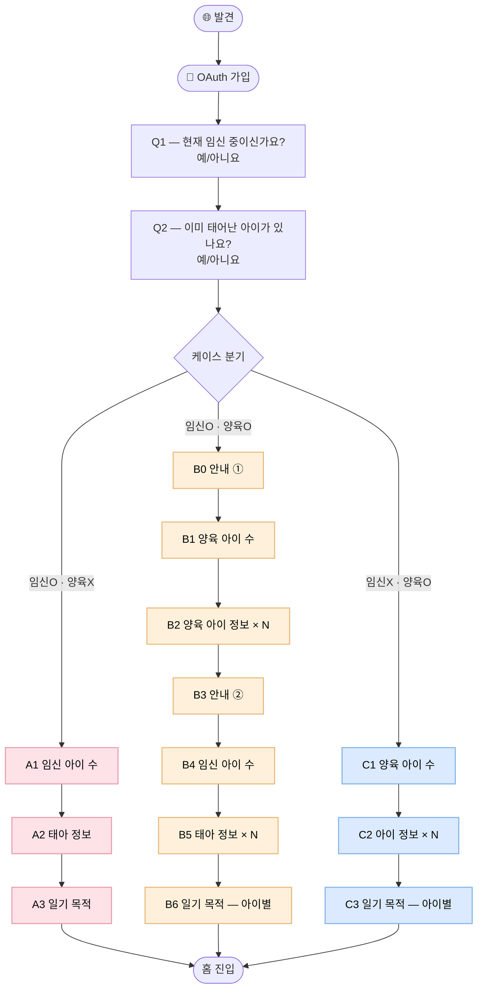

# Onboarding Journey — 발견 · 가입 · 케이스 분기 · 케이스별 입력

> 사용자가 디어베이비를 처음 알게 되는 순간부터 케이스별 입력을 마치고 홈에 진입하기 직전까지의 여정.

| 항목 | 내용 |
|---|---|
| **다루는 단계** | Stage 1 발견 → Stage 2 가입 → Stage 3 케이스 분기 → Stage 4 케이스별 입력 |
| **관련 PRD** | [PRD-006: 케이스 분기 온보딩 및 아이 컨텍스트 관리](../prd/PRD-006-onboarding-cases.md) |
| **관련 시스템 흐름** | [`flows/onboarding-flow.md`](../flows/onboarding-flow.md) |
| **관련 화면** | [`mockups/`](../mockups) |
| **관련 페르소나** | 🌸 Case A · 🌼 Case B · 🌿 Case C 모두 |
| **앞 플로우로부터 인계** | (없음 — 첫 플로우) |
| **다음 플로우로 인계** | 케이스(A/B/C) · 활성 아이 정보 · 임신 주차/예정일 또는 양육 일수 → [Daily Recording Journey](daily-recording-journey.md) |

---

## 개요

회원가입 직후 두 개의 독립 체크(임신 / 양육)로 사용자를 Case A / B / C 로 분기시키고, 각 케이스에 맞는 정보 입력을 거쳐 공통 홈으로 합류시키는 여정. **사용자 관점에서 이 플로우의 성패는 "입력 부담을 얼마나 잘 흡수하느냐"에 달려 있다.**

특히 Case B(양육 + 임신)는 8화면이라는 객관적으로 긴 입력 흐름을 거치므로 (양육 아이가 N명이면 B2 ↔ B2-Purpose 가 N회 반복되어 더 길어진다), 본 플로우의 페인포인트가 가장 집중되는 케이스다.

---

## 흐름도



---

## 단계별 상세

각 단계를 ① **사용자 행동** ② **사용자 감정·생각** ③ **시스템 응답 (PRD/AC 매핑)** ④ **페인포인트 / 기회** 4축으로 정리한다.

### Stage 1 — 🌐 발견 (Discovery)

| 축 | 내용 |
|---|---|
| **사용자 행동** | SNS, 산모 커뮤니티, 지인 추천, 광고를 통해 "음성으로 임신 일기를 쓰면 책이 만들어진다"는 컨셉을 처음 접한다 |
| **사용자 감정·생각** | "이거 나한테 딱이네 — 일기 쓸 시간이 없는데 말로만 하면 된다고?" / "근데 진짜 자연스럽게 될까?" |
| **시스템 응답** | (제품 외부 — 본 PRD 범위 밖, 마케팅 자산 영역) |
| **페인포인트 / 기회** | ⚠️ 음성 인식 정확도, AI가 만든 책의 품질에 대한 의구심 → 🌱 데모 영상·실제 책 샘플 노출 기회 |

### Stage 2 — 📲 가입 (Sign-up)

| 축 | 내용 |
|---|---|
| **사용자 행동** | 앱 다운로드 → OAuth(Google/Apple) 1탭 로그인 |
| **사용자 감정·생각** | "복잡한 가입 절차였으면 그냥 닫았을 텐데, 다행이다" |
| **시스템 응답** | 백엔드 인증 시스템 (`backend/internal/users`, `oauth_accounts`, `RefreshStore`) |
| **페인포인트 / 기회** | ⚠️ Google/Apple 외 옵션이 없을 때 일부 사용자 이탈 가능 → 🌱 가입 단계가 짧을수록 진입 부담 ↓ |

### Stage 3 — 🔀 케이스 분기 (Q1·Q2 두 독립 체크)

| 축 | 내용 |
|---|---|
| **사용자 행동** | "현재 임신 중이신가요?" → 예/아니요 / "이미 태어난 아이가 있나요?" → 예/아니요 |
| **사용자 감정·생각** | "이런 걸 묻는다는 건 내 상황에 맞춰주려는 거구나" — 안도감. (단, Case B 사용자는 "둘째인데 이걸 제대로 받아주려나?"라는 기대를 가진다) |
| **시스템 응답** | **PRD-006 / AC-006-01** — 두 답변 조합으로 Case A·B·C 자동 분기 |
| **페인포인트 / 기회** | ⚠️ "임신 X · 양육 X" 조합이 정의되지 않음 (PRD-006 미해결 항목) → 🌱 둘 다 묻는 분기 자체가 "당신의 상황을 알아본다"는 메시지로 작동 |

### Stage 4 — 🌸🌼🌿 케이스별 정보 입력

각 케이스의 화면 단위 정보는 [`mockups/`](../mockups)에 있다. 본 문서는 **사용자 관점의 부담 차이**에 집중한다.

| 케이스 | 화면 수 | 사용자 감정 | 핵심 입력 부담 완화 장치 | 관련 AC |
|---|:---:|---|---|---|
| 🌸 **Case A** | 3 (A1~A3) | "간단하네 — 시작이 쉬웠다" | 태명/사진 모두 (선택) · "예정일 미정" 옵션 | AC-006-02 |
| 🌼 **Case B** | 8 (B0·B1·B2·B2-Purpose·B3·B4·B5·B6) | "양 많은데 단계가 잘 나눠져 있어서 견딜 만하다 — 양육 아이마다 어떤 기록을 남길지 따로 물어봐 주는 게 세심하다" | B0/B3 안내 화면이 양육·임신 두 단계를 명시적으로 끊어줌 (단계 인디케이터 ①→②) · 양육 아이는 정보 입력 직후 1:1 (B2-Purpose) 로 일기 목적을 받고, 태아는 마지막 B6 에서 1회만 묻고 모든 태아에 동일 적용 (Case A 와 동일 모델) | AC-006-03 |
| 🌿 **Case C** | 3 (C1·C2·C3) | "임신 질문 거치지 않아도 되는 게 다행 — 아이마다 다른 결의 기록을 남길 수 있다" | (Case A와 동일한 입력 허들 완화 장치) · 양육 아이마다 정보(C2) → 일기 목적(C3) 을 1:1 화면 한 쌍으로 받아 다자녀 사용자가 아이별로 다른 톤을 고를 수 있게 한다 (Case B 양육 입력과 동일 모델) | AC-006-04 |

#### 카피 톤이 곧 가치 체험

[`mockups/`](../mockups)의 카피대로, 본 플로우의 카피는 **V-001 (감정 보존)** 가치를 가입 첫 순간부터 체감시킨다.

| ❌ 시스템 톤 | ✅ DearBaby 톤 | 가치 체험 |
|---|---|---|
| "출산 예정일을 입력하세요" | "아기를 만날 날을 알려주세요" | 입력이 사무 처리가 아니라 감정 행위로 느껴짐 |
| "사용 목적 설정" | "어떤 마음으로 기록을 남기고 싶나요?" | "마음"이라는 단어가 V-001을 시작부터 깐다 |
| "다음" / "확인" | "시작하기" / "계속하기" / "홈으로 시작하기" | 행위에 의미가 부여됨 |

#### 입력 허들 낮추는 장치 (모든 케이스 공통)

- 예정일 입력에 "아직 정해지지 않았어요" 옵션
- 사진 / 태명 / 한줄 소개는 모두 (선택)
- 성별에 "미정" 선택지 항상 포함
- B0·B3 안내 화면으로 입력 부담을 단계별로 분산

---

## 케이스별 미니 감정 곡선

본 플로우 안에서의 감정 변화. 케이스마다 모양이 다르다.

```
강도 ↑
높음 │       ●(분기 안도)                           ●(홈 진입 직전 기대)
     │      ╱  ╲                                  ╱
     │   ●     ╲                              ╱
중간 │  (가입)   ╲ ──────────── A: 짧고 안정 ────────────
     │              ╲                            
     │               ╲ ─ B: 8화면 평탄 구간 ⚠ 이탈 위험 ─
     │                                          
낮음 │                ╲ ───── C: 짧고 안정 ─────         
     └────┬────┬────┬────┬────┬────┬────┬────┬────→
       발견  가입  Q1   Q2   분기  중간  마지막  홈진입
                              입력  입력  화면
```

---

## 페인포인트 & 기회

| # | 단계 | 페인포인트 | 완화 메커니즘 (현재) | 추가 기회 |
|---|---|---|---|---|
| 1 | Stage 1 | 음성 인식 / AI 책 품질에 대한 의구심 | (제품 외부) | 데모 영상·실제 책 샘플 노출 |
| 2 | Stage 2 | OAuth 외 옵션 부재 시 일부 이탈 | 1탭 로그인 자체가 짧음 | 이메일 옵션 추가 검토 |
| 3 | Stage 3 | "임신 X · 양육 X" 미정의 | (PRD-006 미해결) | 향후 케이스 검토 |
| 4 | Stage 4 (Case B) | 8화면 — 중도 이탈 위험 (다자녀일 경우 더 길어짐: 양육 N명 → B2 + B2-Purpose × N) | B0·B3 안내 화면 + 단계 인디케이터 ①→② · 양육은 아이별 1:1, 태아는 1회 입력으로 인지 부담 최소화 | 입력 진행률 % 표시, "이만큼 남았어요" 카피 |
| 5 | Stage 4 | 시스템 톤 카피의 정서적 거리감 | mockup 카피 가이드 | 모든 신규 카피 작성 시 가이드 강제 적용 |

---

## 가치 매핑

| 단계 | V-001 감정 보존 | V-002 부담 제거 | V-005 주차 맞춤 | V-007 멀티미디어 |
|---|:---:|:---:|:---:|:---:|
| 3. 케이스 분기 | | ●● | | |
| 4. 케이스별 입력 | ● | ●● | ● | ● |

> ●●● 핵심 가치 / ●● 보조 가치 / ● 부수 가치

**관찰**: 본 플로우는 **V-002 (부담 제거)**가 지배적이다. 케이스 분기와 입력 허들 완화 장치들이 모두 V-002를 위해 작동한다. V-001 (감정 보존)은 카피 톤을 통해 부수적으로 깔린다.

---

## 다음 플로우로의 인계

본 플로우 종료 시 다음 정보가 다음 플로우로 인계된다.

| 인계 항목 | 값 | 다음 플로우에서의 역할 |
|---|---|---|
| 케이스 | A · B · C 중 하나 | 홈 화면 구성, 출산 전환 가능 여부 결정 |
| 활성 아이 정보 | 이름/태명, 성별, 생년월일 또는 예정일, 한줄 소개, 사진 | 모든 후속 화면의 컨텍스트 |
| 임신 주차 또는 양육 일수 | 자동 계산값 | 오늘의 질문 매칭 (PRD-002) |
| 일기 목적 | 책 만들기 / 추억 보관 / 가족 공유 / 감정 일기 (복수) | 추후 서사·책 제작 톤 결정에 반영 |
| 다자녀 여부 | true / false | 홈 상단 아이 전환 탭 노출 여부 (AC-006-08) |

---

## 관련 문서

- [`flows/onboarding-flow.md`](../flows/onboarding-flow.md) — 시스템 흐름도
- [`mockups/`](../mockups) — 화면 mockup
- [`prd/PRD-006-onboarding-cases.md`](../prd/PRD-006-onboarding-cases.md) — Acceptance Criteria
- [→ 다음 플로우: Daily Recording Journey](daily-recording-journey.md)
- [← 인덱스로 돌아가기](README.md)
