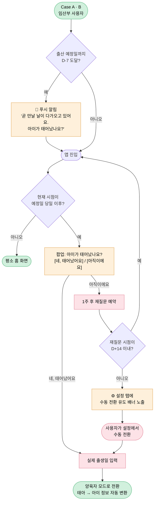
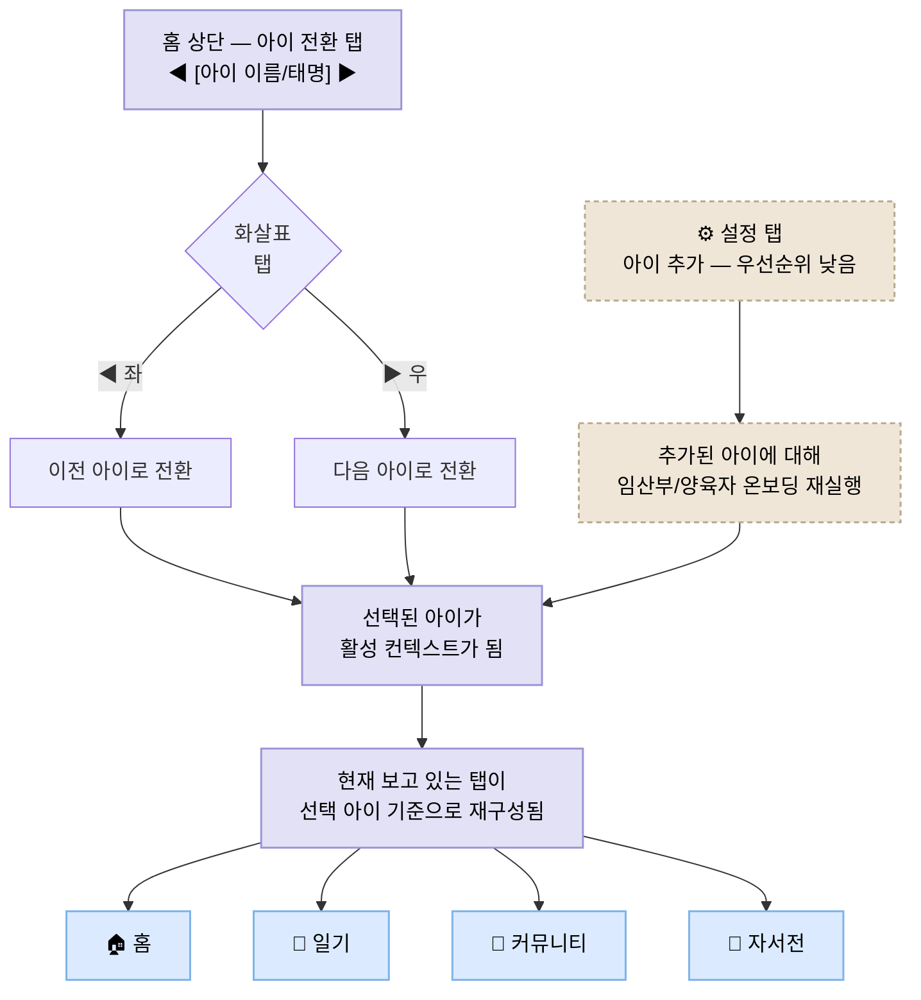

# PRD-006: 케이스 분기 온보딩 및 아이 컨텍스트 관리

## 개요

회원가입 직후 사용자의 상태(임신/양육)에 맞춰 온보딩을 분기하고, 출산 시점에 임산부 모드 → 양육자 모드로 자연스럽게 전환하며, 다자녀 사용자에게 아이별 독립 컨텍스트를 제공하는 기능이다.

본 PRD는 다음 세 가지 영역을 한 묶음으로 정의한다.

1. **케이스 분기 온보딩** — [`docs/flows/onboarding-flow.md`](../flows/onboarding-flow.md) 의 Case A / B / C 입력 흐름을 인수 조건 단위로 정리
2. **출산 전환 플로우** — Case A·B 사용자가 출산 시점에 양육자 모드로 자동·수동 전환되는 메커니즘
3. **다자녀 컨텍스트 관리** — Case B / 다자녀 양육자가 아이 단위로 홈·일기·커뮤니티·자서전을 사용할 수 있는 컨텍스트 시스템

세 영역은 모두 "사용자가 지금 어떤 상태에 있는지"를 시스템이 정확히 추적·전환·확장한다는 공통 책임을 가지므로 한 PRD로 묶는다.

## 제공 가치

- **V-001 (감정 보존)**: 케이스/아이 단위로 기록을 분리해, 각 아이마다 고유한 감정 기록이 영구적으로 보존되도록 한다
- **V-002 (기록의 부담 제거)**: 출산 전환과 아이 추가를 자동 알림·한 번 묻기로 처리해 사용자가 설정 작업에 시간을 쓰지 않게 한다
- **V-005 (임신 주차별 맞춤 질문)**: 예정일·실제 출생일을 정확히 수집하고 출산 후 자동 갱신하여 주차 기반 컨텍스트를 정확하게 유지한다
- **V-006 (실물 책 완성품)**: 아이별 컨텍스트가 보장되어야 아이별 책 제작이 가능하다
- **V-007 (멀티미디어 감정 표현)**: 아이 정보(이름/태명·성별·생년월일·한줄 소개·사진)가 케이스별 입력 단계에서 함께 수집된다

---

## 우선순위

| 영역 | 우선순위 | 비고 |
|---|---|---|
| 케이스 분기 온보딩 (AC-006-01 ~ AC-006-04) | **High** | Case A/B/C 기본 분기. 기존 흐름도 기반 |
| 출산 전환 플로우 (AC-006-05 ~ AC-006-07) | **High** | "임산부 온보딩" 섹션 내에서 본 항목만 중요로 분류됨 |
| 다자녀 — 아이 전환 탭 (AC-006-08, AC-006-09) | **High** | Case B 동작의 전제 조건 |
| 다자녀 — 설정 탭 아이 추가 (AC-006-10) | **Low** | 후속 릴리스 검토 |

---

## 출산 전환 플로우 (요약 흐름도)

## 다자녀 컨텍스트 흐름 (요약 흐름도)

---

## Acceptance Criteria

### AC-006-01: 두 개의 독립 체크로 케이스 분기

- **설명**: 회원가입 직후 임신 여부와 기존 양육 여부를 각각 독립적으로 묻고, 두 답변의 조합으로 사용자를 Case A / B / C 중 하나로 자동 분기한다
- **달성 가치**: V-002
- **조건**:
  - "현재 임신 중이신가요?"와 "이미 태어난 아이가 있나요?"를 두 개의 독립된 화면(또는 단계)으로 묻는다
  - 각 질문은 예/아니요 두 옵션으로 제공된다
  - 두 답변의 조합 결과를 기준으로 다음 케이스로 분기한다
    - 임신 O · 양육 X → Case A
    - 임신 O · 양육 O → Case B
    - 임신 X · 양육 O → Case C
  - 임신 X · 양육 X 조합은 현재 정의되지 않았으므로 일단 Case A 입력 흐름으로 안내하되 안내 카피로 사용자에게 양해를 구한다 (향후 별도 케이스 검토 대상)

### AC-006-02: Case A 입력 흐름 (첫 아이 임신 중)

- **설명**: Case A 사용자는 태아 정보 한 그룹만 입력하고 홈에 진입한다
- **달성 가치**: V-002, V-005, V-007
- **조건**:
  - 임신 아이 수(단태/다태)를 선택한다
  - 태아 정보를 입력한다: 태명(선택), 성별(미정 포함), 임신 주차, 출산 예정일
  - 기록 목적을 복수 선택한다 — 다태인 경우에도 1회만 묻고 모든 태아에 동일하게 적용한다 (아이별 개별 선택은 후속 작업)
  - 기록 목적 화면(A3)에서 제공되는 칩 옵션은 다음 8가지이며, 한국어 라벨 그대로 클라/API/DB에 저장된다

    | 라벨 | 기본 선택 |
    |---|---|
    | 매일의 마음 | ✅ |
    | 몸의 변화 | ✅ |
    | 아이에게 편지 | |
    | 꿈·예감 | |
    | 가족 이야기 | |
    | 병원 기록 | |
    | 준비물 정리 | |
    | 나만의 작명 | |

  - 입력이 끝나면 공통 홈 화면으로 진입한다

### AC-006-03: Case B 입력 흐름 (양육 + 임신 중)

- **설명**: Case B 사용자는 ① 양육 중 아이 → ② 임신 중 아이 순으로 두 단계 입력을 거친 뒤 홈에 진입한다
- **달성 가치**: V-001, V-002, V-005, V-007
- **조건**:
  - **① 양육 중인 아이 먼저**
    - 양육 중 아이 수(1명/2명/3명 이상)를 선택한다
    - 각 아이별로 이름·성별·생년월일·한줄 소개·사진(선택)을 입력한다 (아이 수만큼 반복)
  - **② 임신 중인 아이 이어서**
    - 임신 중 아이 수(단태/다태)를 선택한다
    - 각 태아별로 태명·성별·임신 주차·예정일을 입력한다 (태아 수만큼 반복)
  - **③ 기록 목적**
    - 양육 아이는 정보 입력 직후 1:1 화면(B2-Purpose)에서 아이별로 다른 목적을 선택할 수 있다 (아이별 선택 UI 제공)
    - 태아는 모든 입력이 끝난 뒤 한 번만 묻고 모든 태아에 동일하게 적용한다 (Case A 와 같은 모델 — 태아별 개별 선택은 후속 작업)
    - 양육 아이의 칩 옵션은 AC-006-04 의 8 가지(`CASE_C_PURPOSES`)와 동일하며, 태아의 칩 옵션은 AC-006-02 의 8 가지(`CASE_A_PURPOSES`)와 동일하다 (라벨 SoT 그대로)
  - 입력이 끝나면 공통 홈 화면으로 진입한다

### AC-006-04: Case C 입력 흐름 (순수 양육자)

- **설명**: Case C 사용자는 양육 중인 아이 정보만 입력하고 홈에 진입한다
- **달성 가치**: V-001, V-002, V-007
- **조건**:
  - 양육 중 아이 수(1명/2명/3명+)를 선택한다
  - 각 아이별로 이름·성별·생년월일·한줄 소개·사진을 입력한다
  - 양육 아이마다 정보(C2) 입력 직후 1:1 화면(C3)에서 기록 목적을 선택한다 — C2 ↔ C3 흐름이 아이 수만큼 반복되며, 마지막 아이의 C3 [시작하기]에서 모든 아이 행을 한 번에 영속화한다 (아이별 개별 선택)
  - 기록 목적 화면(C3)에서 제공되는 칩 옵션은 다음 8가지이며, 한국어 라벨 그대로 클라/API/DB에 저장된다

    | 라벨 | 기본 선택 |
    |---|---|
    | 일상의 발견 | ✅ |
    | 말과 행동의 성장 | ✅ |
    | 웃긴 순간 | |
    | 음식·취향 | |
    | 친구와의 시간 | |
    | 가족 이벤트 | |
    | 병원·건강 | |
    | 마음의 변화 | |

  - 입력이 끝나면 공통 홈 화면으로 진입한다

> **운영 규칙 (AC-006-02 / AC-006-04 공통)**: 칩 라벨은 클라이언트·API·DB의 단일 소스(SoT)다. 라벨을 변경하면 기존 DB에 저장된 값과 의미 단절이 발생하므로 **breaking change**로 취급한다. 라벨 변경·추가·삭제 시에는 데이터 마이그레이션을 동반해야 한다.

### AC-006-05: 출산 D-7 푸시 알림

- **설명**: Case A·B 사용자에게 출산 예정일 7일 전부터 출산 여부를 묻는 푸시 알림을 발송한다
- **달성 가치**: V-002, V-005
- **조건**:
  - 출산 예정일 D-7 시점에 푸시 알림이 발송된다
  - 알림 카피는 "곧 만날 날이 다가오고 있어요. 아이가 태어났나요?" 와 의미상 동일한 따뜻한 톤이어야 한다 (디자인 시스템의 카피라이팅 원칙 준수)
  - 알림을 탭하면 앱이 실행되며, 예정일 도달 후라면 AC-006-06 의 출산 확인 팝업이 표시된다
  - 임신 중인 아이가 둘 이상(다태)인 경우 알림은 1회만 발송한다 (아이별 중복 발송 방지)

### AC-006-06: 출산 확인 팝업 및 양육자 모드 전환

- **설명**: 예정일 당일 또는 그 이후 앱 진입 시 출산 여부를 묻는 팝업을 표시하고, "네"를 선택하면 실제 출생일 입력 후 양육자 모드로 전환한다
- **달성 가치**: V-002, V-005
- **조건**:
  - 임신 중인 아이가 있고 현재 시점이 예정일 당일 이후일 때, 앱 진입 시 팝업이 표시된다
  - 팝업 옵션은 [네, 태어났어요] / [아직이에요] 두 가지다
  - **[네, 태어났어요]** 선택 시:
    - 실제 출생일 입력 화면으로 이동한다
    - 출생일 입력 후 해당 아이는 태아 → 아이 데이터로 자동 변환된다
    - 임신 주차 기반 컨텍스트가 양육 일수 기반 컨텍스트로 갱신된다
    - 다태아인 경우 각 아이별로 출생일을 개별 입력할 수 있다
  - **[아직이에요]** 선택 시:
    - 1주 후 같은 팝업이 다시 표시된다
    - 단, AC-006-07 의 D+14 한계 내에서만 자동 재질문이 반복된다

### AC-006-07: 출산 미전환 시 수동 전환 유도

- **설명**: 출산 예정일 D+14 이후에도 출산 전환이 일어나지 않으면, 자동 팝업은 중단하고 설정 탭에 수동 전환 유도 배너를 노출한다
- **달성 가치**: V-002
- **조건**:
  - D+14 시점에 자동 출산 확인 팝업은 더 이상 표시되지 않는다
  - 설정 탭 진입 시 "출산하셨나요? 양육자 모드로 전환하기" 와 의미상 동일한 따뜻한 카피의 배너가 표시된다
  - 배너를 탭하면 AC-006-06 의 실제 출생일 입력 화면으로 이동한다
  - 사용자가 배너를 닫더라도 다음 설정 탭 진입 시 다시 표시된다 (세션 단위 닫기는 가능, 영구 닫기는 불가)

### AC-006-08: 홈 상단 아이 전환 탭

- **설명**: 다자녀 사용자(Case B / 다자녀 양육자 / 임신 다태아 포함)에게 홈 상단에 아이 전환 탭을 노출한다
- **달성 가치**: V-001, V-002
- **조건**:
  - 아이가 2명 이상인 경우에만 전환 탭이 노출된다
  - 전환 탭 중앙에는 현재 선택된 아이의 이름(양육 중) 또는 태명(임신 중)이 표시된다
  - 좌·우에 화살표가 표시된다
  - 화살표를 탭하면 이전/다음 아이로 활성 컨텍스트가 전환된다
  - 마지막 아이에서 ▶ 를 누르면 첫 아이로 순환한다 (좌·우 양방향 순환)
  - 임신 중 아이와 양육 중 아이가 섞여 있어도 단일 리스트로 순회 가능하다

### AC-006-09: 선택된 아이 기준으로 모든 탭이 동작

- **설명**: 사용자가 아이 전환 탭으로 활성 아이를 변경하면, 홈/일기/커뮤니티/자서전 탭이 모두 선택된 아이를 기준으로 재구성된다
- **달성 가치**: V-001, V-006
- **조건**:
  - **홈 탭**: 선택된 아이의 주차/일수, 오늘의 질문, 최근 기록 미리보기가 해당 아이 기준으로 표시된다
  - **일기 탭**: 선택된 아이의 기록만 목록으로 표시된다
  - **커뮤니티 탭**: 선택된 아이의 케이스(임신/양육)와 주차에 맞는 커뮤니티 컨텍스트로 진입한다
  - **자서전 탭**: 선택된 아이의 책(자서전)을 보여준다
  - 활성 아이는 앱 세션 간에 유지된다 (앱 재실행 후에도 마지막 선택 아이가 유지)
  - 새 기록 작성 시 기본 대상 아이는 활성 아이로 자동 지정된다 (변경 가능)

### AC-006-10: 설정 탭에서 아이 추가 — *우선순위 낮음*

- **설명**: 사용자가 설정 탭에서 새 아이를 추가할 수 있으며, 추가 시 해당 아이에 대한 임산부/양육자 온보딩이 동일하게 진행된다
- **달성 가치**: V-001, V-002
- **우선순위**: Low — 후속 릴리스 검토
- **조건**:
  - 설정 탭에 "아이 추가" 진입점이 있다
  - 아이 추가 진입 시, 임신 / 양육 여부를 묻는 단일 케이스 분기가 다시 시작된다 (AC-006-01 의 두 독립 체크 중 해당하는 부분만 재사용 가능)
  - 임신 중 아이를 추가하면 Case A 의 태아 정보 입력(AC-006-02 입력 항목)을 그대로 거친다
  - 양육 중 아이를 추가하면 Case C 의 아이 정보 입력(AC-006-04 입력 항목)을 그대로 거친다
  - 추가가 완료되면 아이 전환 탭(AC-006-08)에 새 아이가 자동 합류한다

---

## 비기능 요구사항

- **푸시 알림 권한 미허용 시**: AC-006-05 의 D-7 푸시는 발송되지 않으나, AC-006-06 의 인앱 팝업은 정상 동작해야 한다
- **시간대**: 예정일 D-7, 당일, D+14 의 기준 시각은 사용자 단말의 로컬 타임존을 따른다
- **케이스 변경 가능성**: 출산 전환 외에는 케이스 자체를 사용자가 임의로 변경할 수 없다 (잘못 입력한 경우 설정 탭의 개별 아이 정보 수정으로 대응)

---

## 관련 문서

- [Onboarding Flow — 케이스 분기 온보딩 전체 흐름도](../flows/onboarding-flow.md)
- [Mockups — 화면 시각 산출물](../mockups)
- [PRD-001: 음성 일기 기록](PRD-001-voice-diary.md) — 활성 아이 기준 기록 작성
- [PRD-002: 매일 다른 질문 알림](PRD-002-daily-questions.md) — 활성 아이의 주차 기반 질문
- [PRD-004: 실물 책 제작](PRD-004-book-production.md) — 활성 아이별 책 제작
- [용어집](../glossary.md)

---

## 미해결 / 향후 검토

- **임신 X · 양육 X 케이스**: 현재 분기에서 정의되지 않음. 임신 계획 단계 사용자에 대한 별도 흐름 검토 필요
- **사산 / 유산 케이스**: 출산 전환 플로우의 [아직이에요] 반복 후 D+14 한계 도달 시 더 세심한 안내가 필요할 수 있음. 별도 가이드라인 마련 검토
- **아이 전환 탭의 정렬 규칙**: 임신 중/양육 중 아이가 섞여 있을 때의 기본 정렬 순서 (생년월일순? 등록순?) 결정 필요
- **AC-006-10 의 정확한 진입점 위치**: 설정 탭 내 메뉴 구조 확정 후 명세
