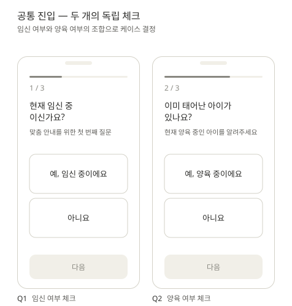
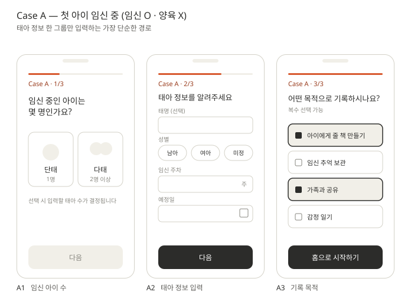
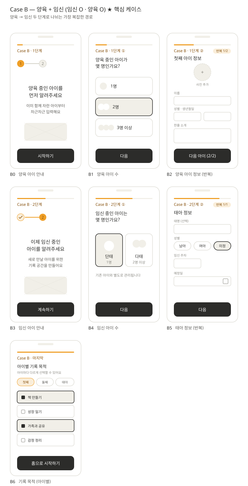
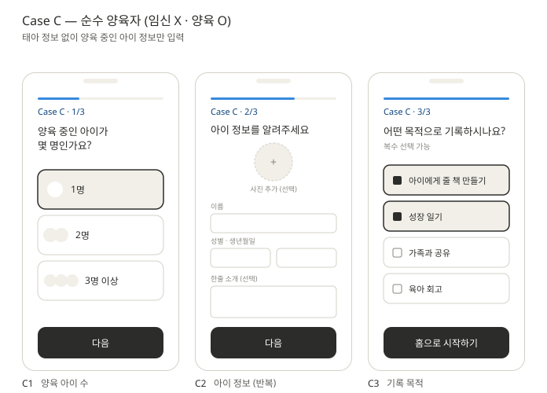

# 온보딩 와이어프레임

[`docs/flows/onboarding-flow.md`](../flows/onboarding-flow.md)의 케이스 분기 흐름을 기반으로 한 온보딩 화면 와이어프레임 모음.

회원가입 직후 두 개의 독립 체크(임신 / 양육)로 사용자를 세 가지 케이스로 분기하고, 각 케이스에 맞는 정보 입력을 거쳐 공통 홈으로 합류시키는 전체 흐름을 화면 단위로 정의한다.

| 케이스 | 조건 | 화면 수 |
|---|---|---|
| 공통 진입 | — | 2화면 (Q1, Q2) |
| **Case A** | 임신 O · 양육 X | 3화면 (A1–A3) |
| **Case B** ★ | 임신 O · 양육 O | 7화면 (B0–B6) |
| **Case C** | 임신 X · 양육 O | 3화면 (C1–C3) |

---

## 공통 진입 — 두 개의 독립 체크

- **Q1 임신 여부**: "현재 임신 중이신가요?" — 예/아니요 단일 선택
- **Q2 양육 여부**: "이미 태어난 아이가 있나요?" — 예/아니요 단일 선택
- 두 답변의 조합으로 케이스 결정 (임신×양육 → A/B/C)

---

## Case A — 첫 아이 임신 중 (임신 O · 양육 X)

태아 정보 한 그룹만 입력하는 가장 단순한 경로.

- **A1 임신 아이 수**: 단태 (1명) / 다태 (2명 이상)
- **A2 태아 정보**: 태명(선택) · 성별(남아/여아/미정) · 임신 주차 · 예정일
- **A3 기록 목적**: 복수 선택 (책 만들기 / 추억 보관 / 가족 공유 / 감정 일기)

---

## Case B — 양육 + 임신 (임신 O · 양육 O) ★ 핵심 추가 케이스

가장 복잡한 케이스. **양육 → 임신** 두 단계로 나뉘어 입력하며, 각 단계의 진입을 안내 화면(B0, B3)으로 명확히 구분한다.

**1단계 — 양육 중인 아이 먼저**
- **B0 안내**: "양육 중인 아이를 먼저 알려주세요" (단계 인디케이터 ① 활성)
- **B1 양육 아이 수**: 1명 / 2명 / 3명 이상
- **B2 양육 아이 정보** *(아이 수만큼 반복)*: 사진(선택) · 이름 · 성별 · 생년월일 · 한줄 소개

**2단계 — 임신 중인 아이 이어서**
- **B3 안내**: "이제 임신 중인 아이를 알려주세요" (단계 인디케이터 ① 완료, ② 활성)
- **B4 임신 아이 수**: 단태 / 다태
- **B5 태아 정보** *(태아 수만큼 반복)*: 태명 · 성별 · 임신 주차 · 예정일

**마지막 — 기록 목적**
- **B6 기록 목적 (아이별)**: 첫째/둘째/태아 탭으로 전환하며 아이마다 다른 목적 선택 가능

---

## Case C — 순수 양육자 (임신 X · 양육 O)

태아 정보 없이 양육 중인 아이 정보만 입력.

- **C1 양육 아이 수**: 1명 / 2명 / 3명 이상
- **C2 아이 정보** *(아이 수만큼 반복)*: 사진(선택) · 이름 · 성별 · 생년월일 · 한줄 소개
- **C3 기록 목적**: 복수 선택

---

## 공통 합류 — 홈 진입

모든 케이스의 마지막 화면(A3 / B6 / C3)에서 동일한 CTA "홈으로 시작하기"를 통해 공통 홈으로 합류한다. 이후 흐름(홈 화면, 아이 전환 탭, 기록 남기기, 출산 전환, 책 만들기)은 [`docs/flows/onboarding-flow.md`](../flows/onboarding-flow.md)의 공통 플로우 섹션을 참고.

---

## 진행 표시 규칙

| 위치 | 표시 방식 |
|---|---|
| 공통 진입 (Q1·Q2) | 상단 진행 바 + `n / 3` 텍스트 |
| 케이스별 화면 | 케이스 컬러 진행 바 + `Case X · n / 총n` 배지 |
| 반복 입력 (B2·B5·C2) | 우상단 `반복 n/N` 배지 |
| Case B 단계 인디케이터 | B0/B3 안내 화면에 `① → ②` 큰 표시 |

## 케이스 시각 구분

각 케이스는 진행 바와 배지 텍스트의 색상으로 구분하여 사용자가 자신의 흐름을 식별할 수 있게 한다.

| 케이스 | 액센트 색 | 비고 |
|---|---|---|
| 공통 진입 | 그레이 | 케이스 결정 전 중립 |
| Case A | 코랄 | `#D85A30` |
| Case B | 앰버 | `#EF9F27` |
| Case C | 블루 | `#378ADD` |

## 카피 톤 체크리스트

| ❌ 시스템 톤 | ✅ DearBaby 톤 |
|---|---|
| 출산 예정일을 입력하세요 | 아기를 만날 날을 알려주세요 |
| 자녀 정보 등록 | 아이에 대해 알려주세요 |
| 사용 목적 설정 | 어떤 마음으로 기록을 남기고 싶나요? |
| 다음 / 확인 | 시작하기 / 계속하기 / 홈으로 시작하기 |

## 입력 허들 낮추는 장치

- 예정일 입력에 "아직 정해지지 않았어요" 옵션
- 사진 / 태명 / 한줄 소개는 모두 (선택)
- 성별에 "미정" 선택지 항상 포함
- B0·B3 안내 화면으로 입력 부담을 단계별로 분산

---

## 관련 문서

- [`docs/flows/onboarding-flow.md`](../flows/onboarding-flow.md) — 케이스 분기 흐름 정의 (시스템 흐름도)
- [`docs/prd/PRD-006-onboarding-cases.md`](../prd/PRD-006-onboarding-cases.md) — Acceptance Criteria
- [`docs/glossary.md`](../glossary.md) — 용어집 (태아, 양육, 케이스 등)
